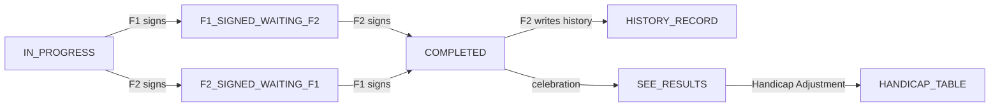

# SICC Ryder Cup — Complete Real-Time Test Protocol

- **Version:** 1.7
- **Date:** 2026-08-09
- **Scope:** Complete end-to-end test protocol for the **real-time, 2-flight** scoring app: **unit tests** of the calculation engine, **cross-flight sync** (both flights update the same game live), **cross-flight triggers** (F1 checks the celebration photo, F2 writes the history record on completion), and **view-game real-time** (a read-only viewer sees the game update live).
- **Complements:** `2026-08-07 SICC Ryder Cup Test Script.md` (manual 2-device flow). This protocol adds the structured unit layer, the realtime concurrency matrix, the cross-flight trigger chain, and an **automated harness**.
- **App under test:** SICC Ryder Cup (Cloudflare Pages + Firebase/Firestore + Storage)

---

## 0. Test Environment & Pre-Requisites

### 0.1 Environments

| Env | URL | Firebase project | Notes |
|-----|-----|------------------|-------|
| Preview / Staging | `https://<hash>.sicc-ryder-cup.pages.dev` or `https://staging.sicc-ryder-cup.pages.dev` | **DEV** (`sicc-ryder-cup-dev`) | Routine testing — safe |
| Production | `https://sicc-ryder-cup.pages.dev` | **PROD** (`sicc-ryder-cup`) | **Final acceptance only** — real data; never destructive |

> ⚠️ DEV Firestore rules were opened (2026-08-07) to `allow read, write: if true` — the app has no auth, so writes must be allowed on the test project. DEV Storage **CORS is misconfigured** (celebration photo fetch → CORS 403) — fix the bucket CORS before testing the photo trigger on DEV, or use PROD for the photo test.

### 0.2 Devices & Identity (critical!)

The app identifies devices by `deviceId` in `localStorage` and locks flights via `locks.f1` / `locks.f2` on the game doc. For a valid real-time test you need **3 distinct device identities**:

| Role | Device identity | Behaviour |
|------|-----------------|-----------|
| **F1 scorer** | `deviceId=A` | Locks `locks.f1`; writes Flight 1 scores |
| **F2 scorer** | `deviceId=B` | Locks `locks.f2`; writes Flight 2 scores |
| **VIEW observer** | `deviceId=C` | Read-only; watches `view-game.html` in real time |

> ⚠️ **Two browser tabs in the same browser context share `localStorage`** → they collapse to one device (found 2026-08-07). For true multi-device simulation use **separate browser contexts** (incognito windows, different browsers, or real devices). Playwright handles this natively with `browser.newContext()` — see §5.

### 0.3 Test Data

- **Course:** a course with known Par/SI (e.g., SICC Bukit; SI 13,15,7,3,17,1,5,11,9,14,2,8,6,16,10,4,18,12).
- **Roster (8 players, 4/team):**
  - Team A: Ang C H (1), Chenh Hoe (10) [F1]; C K (8), Yip H M (12) [F2] → total **31**
  - Team One (internal B): Jeff Goh (0), Ong C B (1) [F1]; Piti (8), James Ong (11) [F2] → total **20**
  - Anchor = **Jeff Goh (0)**
- **Score scenarios:** all-PAR, all-BOGEY, mixed (varies per flight/player), ties, early-clinch layouts.
- **Clean state between runs:** clear `localStorage` on every device (fresh `deviceId`/`sessionId`); use a throwaway game id; optionally delete the test game from `scheduledGames` + `historyGames` after.

---

## 0.5 Test Suites (A/B)

The protocol is grouped into **two suites** plus manual checks.

**Suite A — Admin & Record Integrity (run on-demand; "if it's working, it's working"):**
- New Player, New Game creation, Manage Games
- **N-series** (New Game Record Integrity) — §10
- Run occasionally to verify the admin / record-creation tooling; **not** part of the routine game test.

**Suite B — Actual Game (the Step Runner):**
- The full real-time game journey, ending at **A-series (History Record Integrity)**:
  - **S** (cross-flight sync) · **T** (triggers: photo + F2 writes history) · **M** (completion/signing) · **H** (handicap) · **C** (cascade) · **R** (rejoin/recovery) · **A** (history record integrity) · **E** (edge)
  - **V** (View-Game) — **V1/V2 kept as live real-time observers** during the game (not a separate history-viewing test)
- Driven interactively from the **F1 window control panel** (Step / Go Auto) — §12.

**Manual / not automated:**
- **History Game VIEW** — completed history records are viewed manually.
- Post-completion history-rendering checks (V7, A18–A19 render) are manual.

---

## 1. Unit Tests — Calculation Engine (no network needed)

The engine lives in `game-data.js`, `game-match.js`, `game-team.js`, `game-stroke.js`, `real-game-cascade.js`, `hcp-adjust.js`. Unit tests verify **pure functions** from raw inputs. Run via Node harness (extract functions) or the browser console / the app's Validate tool.

### 1.1 Data-string parser (game-data.js)

| ID | Test | Expected |
|----|------|----------|
| U1 | `getSavedHolesFromString` on a 162-char string with `T` flags at holes 1,3,5 | returns `[1,3,5]` |
| U2 | `getSavedHolesFromString` with `F` flags only | returns `[]` |
| U3 | `parseHoleData` hole segment = 9 chars: 1 flag + 4×2-digit scores | correct per-player scores for the hole |
| U4 | Data string length ≠ 162 | handled (returns null / skipped) |
| U5 | `rotateDataString` starting-hole rotation | play order correct for a shotgun start |

### 1.2 Nett & stroke rules

| ID | Test | Expected |
|----|------|----------|
| U6 | Absolute: hcp 10 gets a stroke where `SI ≤ 10` (holes 2,4,5,7,9,13,15,16 on Bukit) | nett = gross − 1 on those holes |
| U7 | Relative: diff 9 gives 9 strokes on SI ≤ 9 | correct |
| U8 | Handicap 0 → no strokes (absolute) | nett = gross |
| U9 | Stroke game: Team A nett = Σ gross(A) − 31, Team One = Σ gross − 20 | per-hole cumulatives correct |

### 1.3 Match game (16 matches)

| ID | Test | Expected |
|----|------|----------|
| U10 | 16 matches, each A vs each One | 16 per-hole result cells |
| U11 | Per-hole points: match up = +1 to that team, halve = 0.5/0.5 | **16 points/hole** |
| U12 | Clinch detection (lead > holes remaining) | clinchedAt recorded at correct hole |
| U13 | All-PAR + all-PAR → all halved | 8.0 vs 8.0 match points |

### 1.4 T-1 / T-2 (team game)

| ID | Test | Expected |
|----|------|----------|
| U14 | Best nett vs best nett, 2nd vs 2nd, per flight | flight total −2…+2 |
| U15 | Running cumulative + **point to cumulative leader** (not per-hole winner) | `A n` / `O n` / `AS` |
| U16 | Display shortform: internal `B` → display `O` (`B5 → O5`) | correct on both flights |

### 1.5 TR invariant (the key check)

| ID | Test | Expected |
|----|------|----------|
| U17 | `trA + trB = 19` at every hole (Match 16 + T-1 1 + T-2 1 + Strk 1) | holds for **any** score input |
| U18 | Final hole-18 snapshot totals 19 | e.g. `13.0 vs 6.0` |
| U19 | `game1PointsA + game2PointsA + game3PointsA = trA` per hole | holds |

### 1.6 Handicap adjustment

| ID | Test | Expected |
|----|------|----------|
| U20 | Anchor = lowest hcp; anchor match = 18 holes vs anchor with stroke diff | `±1 per 2 holes` won/lost (won → CUT) |
| U21 | Perf adj from 4 match points: ≥3.5 → CUT 1; ≤0.5 → ADD 1 | correct |
| U22 | `New = Old + Perf + Anchor`; zero-rise so lowest New = 0 (new anchor) | correct |

### 1.7 Validate-tool regression (recompute from raw)

| ID | Test | Expected |
|----|------|----------|
| U23 | `util-record-management` → VALIDATE on a completed record | recomputes from f1/f2 strings; **Match Play + T-1 = 0 mismatches** |
| U24 | Fix a deliberately tampered score → re-validate | Fix rebuilds; re-validate passes |
| U25 | **Known edge case (2026-08-07):** Fix on a record missing `matchResults` | logs `No matchResults data found at hole 18`; writes all-zero handicaps → **known gap, tracked** (do not treat as core-logic failure) |

> ✅ During 2026-08-07 testing, U17/U18/U19/U10/U11/U14/U16 were all verified with real recomputation (match 16/hole, TR 19/hole, Strk `A11`, `A#`/`O#` displays).

---

## 2. Cross-Flight Sync Tests (realtime core)

Two scorer devices (F1 + F2) update the **same** game doc; each sees the other's changes live via Firestore listeners.

### 2.1 Basic realtime propagation

| ID | Step | Expected |
|----|------|----------|
| S1 | F1 saves Hole 1 (Flight 1 scores) | F2 device + VIEW see F1's Hole-1 scores **without refresh** |
| S2 | F2 saves Hole 1 (Flight 2 scores) | F1 + VIEW see F2's Hole-1 scores live |
| S3 | Both flights have Hole 1 → check T-1/T-2/Strk/TR row for Hole 1 | computed and identical on all devices |
| S4 | No duplicate writes; no WRV "verify failed" | clean console |

### 2.2 Save-order independence

| ID | Step | Expected |
|----|------|----------|
| S5 | F2 saves H1 **before** F1 saves H1 | final state identical to S3 |
| S6 | F1 saves H1–H18 fully; F2 only H1–H10 | results computed up to min available; F2-side shown as "waiting/unsaved" for H11–H18; **no crash, no stale T-2/Strk** |
| S7 | F2 then completes H11–H18 | full results appear on all devices |

### 2.3 Concurrent writes & integrity

| ID | Step | Expected |
|----|------|----------|
| S8 | F1 and F2 save the **same hole at the same time** | WRV handles it; latest valid write wins; no corruption; both devices converge |
| S9 | After every save: `savedHoles[1]`/`savedHoles[2]` correct; `results.computedUpToHole` = min(flights) | invariant holds |
| S10 | After every save: `trA + trB = 19` for all computed holes (cross data available) | invariant holds |

### 2.4 Role lock enforcement

| ID | Step | Expected |
|----|------|----------|
| S11 | 3rd device tries to take F1 while F1 locked | blocked / takeover modal → can switch to VIEW |
| S12 | Lock expiry / stale lock cleanup | a device with an expired lock can reclaim after grace |

### 2.5 Resilience

| ID | Step | Expected |
|----|------|----------|
| S13 | Kill F2 mid-game; F1 keeps scoring | F1 continues; F2's last saved holes persist |
| S14 | Relaunch F2 (same deviceId) | reconnects, re-syncs, no data loss |
| S15 | Offline moment during save | Firebase retry/WRV shows retry UI; no silent loss |

---

## 3. Cross-Flight Triggers

The completion chain: both flights **sign** → triggers photo check (F1) + history record write (F2/completing device) → celebration.

### 3.1 Signing flow

| ID | Step | Expected |
|----|------|----------|
| T1 | F1 completes all 18 holes → sign/submit Flight 1 card | game shows "F1 signed; waiting for F2"; **F2 + VIEW see this live** |
| T2 | F2 completes 18 holes → sign/submit Flight 2 card | **GAME COMPLETED** modal; celebration triggers on all devices |

### 3.2 F1 → celebration photo (Storage)

| ID | Step | Expected |
|----|------|----------|
| T3 | On completion, **F1 device checks the celebration photo** | F1 fetches `celebration/<gameId>.jpg` (Storage); correct flag set; no 403/CORS (DEV needs bucket CORS fixed) |
| T4 | Photo uploaded/attached | `celebration.imageUrl` written; VIEW/F2 see the photo |

### 3.3 F2 → history record write

| ID | Step | Expected |
|----|------|----------|
| T5 | On completion, **history record is created** in `historyGames` | doc id = `<gameId>_H`, status **completed** |
| T6 | Verify all archive fields: f1/f2 raw data strings, results (match/T-1/T-2/Strk/TR per hole), players, course, signatures, adjustedHandicaps, celebration photo | no missing fields |
| T7 | Handicap adjustment available from history (`hcp-adjust.html`) | read-only, values match record |
| T8 | History list + scorecard render `TEAM ONE` + `O#` margins (v8.53+ verified) | display-only transform; no data migration |

### 3.4 Order / race on the trigger

| ID | Step | Expected |
|----|------|----------|
| T9 | F1 and F2 sign at nearly the same time | exactly one history record created (idempotent); no double-write |
| T10 | F2 signs first, then F1 | completion + history still created once |

---

## 4. View-Game Real-Time Test (read-only viewer)

`view-game.html` is the live observer. Open it on the **VIEW device** while a game is in progress.

| ID | Step | Expected |
|----|------|----------|
| V1 | Open view-game for an **in-progress** game | shows current hole, scores, T-1/T-2/Strk/TR, `TEAM A | TEAM ONE` header |
| V2 | F1 saves Hole 1 | viewer's Flight-1 scores update **live (no refresh)** within ~1s |
| V3 | F2 saves Hole 1 | viewer's Flight-2 scores + T-1/T-2/Strk/TR update live |
| V4 | F1/F2 navigate holes | viewer follows current hole in sync |
| V5 | Read-only check | viewer has **no** editing controls; role is VIEW |
| V6 | Viewer observes completion | sees GAME COMPLETED state + celebration when both flights sign |
| V7 | Viewer opens a **completed** game from history | read-only scorecard, `O#` margins, `TEAM ONE`, correct TR/winner |
| V8 | Viewer during partial game (F2 behind) | shows F2 "waiting" state; does not crash; correct partial T-1 |

> **Assertion:** for V2/V3/V4, record the time from "save on scorer" to "render on viewer" — target **< 2s** on normal network; any need for manual refresh = FAIL.

> **Scope note (2026-08-09):** V1/V2 are used as **live real-time observers** inside Suite B during the game (V1–V6). Post-completion history viewing (V7) and history-rendering checks are **manual** — not automated.

---

## 5. Completion State Machine & Signing-Order Matrix

Every downstream step depends on the prior one; a human missing a step leaves the game in an intermediate state. This section is the dependency test.

### 5.1 State machine



Dependency chain to verify end-to-end: **all 18 holes saved → flight sign → both signed → history record → celebration photo → See Results → Handicap table**.

### 5.2 Confirmed design decisions (2026-08-09)

1. **Operating assumption: both flights are ALWAYS eventually signed.** The waiting state is therefore **transient** — it always resolves once the second flight signs. A stuck-forever game (M3) is **out of scope**; no force-complete / flight-release / admin override is needed.
2. **Scores are locked after a flight signs** — no edits to a signed flight.
3. **Signatures cannot be revoked** — signing is permanent.
4. **Only the F2 scorer device writes the history record** — F1 must NOT write (single-writer prevents the race).
5. **Handicap Raw = before zero-rise; New = after zero-rise** — see §6.

### 5.3 Signing-order / human-error matrix

| # | Scenario | Expected (per decisions) |
|---|----------|--------------------------|
| M1 | **F1 signs, F2 hasn't yet** (normal gap) | F1 sees waiting screen; F2 sees "F1 signed — sign F2 now"; VIEW live; **F1 scores now locked**; state holds until F2 signs |
| M2 | **F2 signs first, F1 hasn't yet** (mirror) | Same as M1 reversed — order must not matter |
| M3 | **Long gap / delayed second sign** (e.g., hours later) | **Assumed always resolves** (both flights always eventually signed). Verify the waiting state holds correctly during the gap (no timeout/errors), then resolves on the second sign. A never-signed dead-end is **out of scope** (2026-08-09) |
| M4 | **Sign with < 18 holes saved** | Blocked with a clear message; nothing written |
| M5 | **Edit a score after signing** | **Blocked (locked)** — scorecard frozen |
| M6 | **Attempt to un-sign / revoke** | **Not possible** — signature permanent |
| M7 | **Double-tap sign (race)** | WRV dedupes; no duplicate writes |
| M8 | **Both sign simultaneously** | Exactly one completion; **history written by F2 only** (F1 must not write) |
| M9 | **Sign while offline / write fails** | WRV retry; eventual consistency; no half-written state |
| M10 | **F2 crashes during history write** | Single-writer = no F1 fallback; verify WRV retry on F2 reconnect; no duplicate/partial record |
| M11 | **VIEW observes the whole journey** | VIEW live-updates through every transition |

---

## 6. Handicap Adjustment — Calculation Scenarios

### 6.1 Formula (confirmed 2026-08-09)

- **Perf Adj** = from 4 match points: ≥ 3.5 → CUT 1; ≤ 0.5 → ADD 1; else 0.
- **Anchor Adj** = 18-hole match vs anchor, strokes = handicap diff; **±1 per 2 holes** won/lost (won → CUT).
- **Raw = Old + Perf Adj + Anchor Adj** — computed **before** zero-rise; may be **0 or negative**.
- **Zero-rise (zerorisation):** if any Raw < 0, shift the **entire table** up so the most-negative Raw becomes **0**.
- **New = Raw + zeroRiseAmount** — always ≥ 0; the player(s) with New = 0 = the **new anchor**.
- Stored: `adjustedHandicaps = { anchor, newAnchor, zeroRiseAmount, players[] }`.

> Example (from earlier testing, anchor JG=0): a player with a big CUT can land on a **negative Raw** (e.g., −3); zero-rise then shifts everyone up by 3 so the lowest New = 0.

### 6.2 Scenarios

| # | Scenario | Expected |
|---|----------|----------|
| H1 | Normal: each player vs anchor (hand-compute first) | Anchor Adj (±1/2 holes, won→CUT), Perf Adj, Raw, zeroRise, New correct |
| H2 | >1 player at lowest handicap | Anchor-selection modal; correct anchor chosen |
| H3 | Big CUT → **negative Raw** | Zero-rise shifts table so most-negative Raw = 0; verify `zeroRiseAmount` + **new anchor** |
| H4 | Perf boundary exactly 3.5 / exactly 0.5 | CUT 1 / ADD 1 exactly (boundaries not missed) |
| H5 | All-square results | No adjustments; Raw = New = Old |
| H6 | All 8 players, both flights | Table grouped `TEAM A` / `TEAM ONE`; every player present |
| H7 | **Raw semantics** | Raw may be 0 or negative; **New ≥ 0**; at least one New = 0 (new anchor) |
| H8 | Record **missing `matchResults`** (legacy / non-standard only) | Should **never** arise in normal play — each hole's `matchResults` is written once the second flight saves that hole, and both flights always eventually save+sign all 18 (2026-08-09). Only legacy / partial / copied-restored records are at risk (the Fix-tool gap, U25). Proven safe by H12; no code fix needed |
| H9 | Persistence & read-only | `adjustedHandicaps` written; re-open from history → read-only, values match |
| H10 | Zero-rise math | `New = Raw + zeroRiseAmount` for every player; `zeroRiseAmount = -min(Raw)` |
| H11 | History re-open | Same New handicaps shown in the history handicap table as at completion |
| H12 | Normal completion → `matchResults` completeness | Both flights save + sign all 18 (incl. one-flight-finishes-first pattern) → `results.matchResults[0..17]` all present; handicap table correct — proves H8 cannot arise in normal play |

---

## 7. Additional Edge Cases (Human / System)

| # | Case | Expected / to verify |
|---|------|----------------------|
| E1 | Long gap between signs (human delay) | Waiting state holds correctly during the gap (no timeouts/errors, app stays usable) and **always resolves** once the second flight signs — both flights are always eventually signed (2026-08-09) |
| E2 | Edit-lock after sign | Signed flight scorecard frozen (M5) |
| E3 | Signature permanent | Cannot un-sign (M6) |
| E4 | History single-writer + idempotency | Exactly one `_H` doc, written by F2, even if completion fires twice |
| E5 | Photo check non-blocking | Photo is updated **every hole except the last playing hole** → a photo is always already in memory at completion, so the completion photo step cannot stall the chain (non-blocking by design, 2026-08-09). **DEV is out of scope** (not synced with MAIN; DEV Storage CORS ignored) |
| E6 | Legacy records | Completed games from before this version render + handicap correctly (display transform, no migration) |
| E7 | Anchor ties / anchor change | Tie at lowest hcp; new anchor after zero-rise |
| E8 | Overnight game (date boundary) | Completion/date handling across midnight |
| E9 | Device rejoin after completion | Offline device reconnecting lands on completed state + history (not stuck) |
| E10 | "See Results" correctness | Winner text (`Team One Wins!`), final TR, `TEAM ONE`/`O#`; stored `finalResults` vs recomputed |
| E11 | Partial saved holes before sign | Sign requires all 18; partial state handled gracefully (M4) |

---

## 8. CASCADE Tests — Back-Navigation Edit & Recalculation

A scorer navigates **backward** to a prior hole and changes a score → the app triggers a **CASCADE** that recomputes **all results affected by that change**, live across devices.

**Scope of a single score change:**
- **F1 change** → recomputes: F1 **intra-flight** matches, F1–F2 **cross-flight** matches, **T-1**, **Strk**. **T-2 is unaffected** (it is F2's team game). Holes **before** the edited hole are unaffected (running totals change only from the edited hole forward).
- **F2 change** (mirror) → recomputes: F2 intra-flight matches, cross-flight matches, **T-2**, **Strk**. **T-1 unaffected**.

| # | Scenario | Verify |
|---|----------|--------|
| C1 | **F1 edits H7 while current = H11** | F1 intra + cross-flight matches, T-1, Strk recomputed H7→H11; **T-2 unchanged**; holes < H7 unchanged |
| C2a | **F2 edits a prior hole (mirror of C1)** | F2 at H12 navigates back to H8, changes a score → **T-2**, cross-flight matches, **Strk** recomputed H8→H12; **T-1 unchanged**; holes < H8 unchanged |
| C2b | **F2 change shifts BOTH teams' Strk** | F2 has players on both teams (Team A: CK, YHM; Team One: P, JO) → a single F2 edit recomputes **both** teams' cumulative nett correctly in Strk |
| C2c | **F2 cascades while F1 already signed** | F1 signed (locked) but F2 still editing its own flight → F2 cascade allowed; F1's locked scores untouched; cross-flight + Strk update; T-1 stays as computed (M5 locks only the signed flight) |
| C2d | **F2 cascade with cross-flight pending** | F2 edits a hole F1 hasn't reached → cross results for that hole shown pending; cascade completes when F1 arrives (mirror of C11 / S6) |
| C3 | **Early vs late edit** | edit H1 → cascade H1→current; edit H17 → cascade H17→current (scope correct) |
| C4 | **Running-margin consistency** | T-1/T-2 margins + Strk cumulatives internally consistent from edited hole → current |
| C5 | **Invariants post-cascade** | `TR = 19/hole`, `match = 16/hole` hold on every recomputed hole |
| C6 | **Clinch re-evaluation** | an existing clinch moves, stays, or is **removed** (`clinchedAt` updated) if the edit changes the math |
| C7 | **Saved-state** | `currentHole` stays (e.g., H11); `savedHoles` correct; edited hole re-saved; no duplicate writes |
| C8 | **Realtime propagation** | F2 + VIEW see the cascade updates live (< 2 s, no refresh) |
| C9 | **Concurrency** | F1 cascade while F2 saves the current hole → WRV handles it; both converge; no corruption |
| C10 | **Signed-flight lock** | back-nav editing blocked after a flight signs → cascade impossible on a signed flight (ties to M5) |
| C11 | **Cross-flight pending** | F1 edits a hole F2 hasn't reached → cross results for that hole shown pending; cascade completes when F2 arrives (ties to S6) |

> C-series re-asserts the invariants (C4/C5), the realtime guarantee (C8), concurrency rules (C9), and the sign-lock decision (C10).

---

## 9. Device Rejoin & Recovery (R-series)

Recoverability: a scorer or viewer **leaves the session** (closes the app, loses connection, kills the device) mid-game and **rejoins later**. The app must re-sync to the current state from Firestore with **no data loss, no duplicate writes, and preserved role/lock integrity**.

**Scorer rejoin (recoverability):**

| # | Scenario | Verify |
|---|----------|--------|
| R1 | **F1 leaves mid-game, rejoins later** | F1 scores to H5, leaves; F2 continues to H10; F1 rejoins → re-syncs H1–H10 (scores, current hole, results); no data loss; can continue its flight |
| R2 | **F1 leaves; F2 completes + signs; F1 rejoins** | F1 sees the waiting/completed state; can still sign its own flight; completion proceeds correctly |
| R3 | **Role/lock recovery on rejoin** | F1 still owns its flight lock after rejoin (persisted in Firestore); no lock conflict / re-lock race (ties to S11/S12) |
| R4 | **Rejoin after WRV / offline save** | No duplicate/corrupt writes (ties to S15 / M9) |
| R5 | **Multiple leave/rejoin cycles** | Stable across cycles; no data loss; no accumulating errors |
| R6 | **Rejoin mid-cascade** | Other flight edited a prior hole while F1 was away → F1 re-syncs the cascaded results correctly |

**Viewer rejoin (≥ 2 View sessions):**

| # | Scenario | Verify |
|---|----------|--------|
| R7 | **Two VIEW devices join the live game** | Both see identical live state (consistency across viewers) |
| R8 | **VIEW-1 leaves; VIEW-2 continues** | VIEW-2 unaffected (no dependency on the other viewer) |
| R9 | **VIEW-1 rejoins later** | Re-syncs to current state and resumes live updates (no refresh, no stale) |
| R10 | **VIEW rejoins after completion** | Lands on the completed state / history (not stuck) (ties to E9) |
| R11 | **VIEW role integrity after rejoin** | Still read-only; cannot become a scorer (ties to V5) |

> R-series re-asserts recovery guarantees (no data loss / no duplicate writes), lock persistence (R3), and viewer consistency across multiple sessions (R7–R11).

---

## 10. New Game Record Integrity — Correct Starting Point (N-series)

> **Suite A (on-demand):** this section verifies the admin / record-creation tooling — run it occasionally, not on every game.

Immediately after **committing a new game** in setup, verify the created `scheduledGames` record is a **correct starting point**: complete per the setup entered, with the proper initial (empty / unsaved) state so the real-time flow begins from a clean, consistent baseline.

**Creation & setup fidelity:**

| # | Check | Verify |
|---|-------|--------|
| N1 | Record created once | Exactly one `scheduledGames` record with a valid id (`GM_YYMMDD_HHMM_XX`); no duplicates |
| N2 | Date & status | `date` matches the setup date; `status = "scheduled"`; shows as GAME DAY |
| N3 | Course & format | course (name / par / SI), startingHole, teamGameFormat match the setup form |
| N4 | Players | exactly 8; 4 per team (A + One/B); 2 per flight per team; name / label / handicap / team / flight correct |
| N5 | Anchor | lowest-handicap player (or the selected anchor when > 1 lowest) |

**Initial data state (correct starting point):**

| # | Check | Verify |
|---|-------|--------|
| N6 | Raw score data | `f1.d` / `f2.d` = default Par strings: 162 chars, 18 holes, all `F` (untouched) flags, scores = course par rotated for startingHole |
| N7 | Flight flags | `f1.se` / `f2.se` = false, `f1.x` / `f2.x` = false (not signed, not marked) |
| N8 | Locks & start | `locks.f1` = null, `locks.f2` = null; `gameStarted` = false |
| N9 | Current holes | `currentHoleF1` = 1, `currentHoleF2` = 1 |
| N10 | Saved holes | `savedHoles` = `{"1": [], "2": []}` |
| N11 | Signatures | both flights unsigned (`signed: false`, `signedAt: null`, `captainName: null`) |
| N12 | Results (empty) | `matchResults` empty; T-1/T-2 displays `AS`; Strk `AS`; TR nulls; `computedUpToHole` 0 / −1; `lastSyncedPosition` = −1 |
| N13 | Meta | `createdAt` / `updatedAt` present; gameId linkage correct |

**Readiness & round-trip:**

| # | Check | Verify |
|---|-------|--------|
| N14 | Pre-game loads | new game opens in pre-game with correct players, `TEAM A` / `TEAM ONE`, flights, anchor |
| N15 | TEE OFF ready | role selection + TEE OFF works from this baseline (nothing missing blocks it) |
| N16 | Round-trip | re-open setup (Manage Games / edit) shows identical data (no drift) |
| N17 | Parser sanity | `getSavedHolesFromString` on f1/f2 returns `[]` (no holes saved yet) |

> N-series gives the **correct starting point** so every later check (S, T, M, H, C, R, A) has a known-clean baseline. The Playwright harness (§12) should assert N1–N17 after every new-game commit.

---

## 11. History Record Integrity — Post-Completion Archive Check (A-series)

At the end of a **completed game**, verify the `_H` history record is **complete, correct, and faithfully archived** — every field required by the History Record schema is present and correctly written to Firestore.

**Schema completeness (every required field present & non-null):**

| # | Check | Verify |
|---|-------|--------|
| A1 | Record exists & unique | Exactly one `historyGames/<gameId>_H` doc; `status = completed`; no duplicates |
| A2 | Game info | date, course (name / par / SI), startingHole, teamGameFormat, anchor all present |
| A3 | Players | all 8 players with name, label, handicap, team, flight |
| A4 | Raw score data | `f1.d` / `f2.d` (or f1DataString/f2DataString) present, non-empty, valid format (162 chars, T/F flags), match what was played |
| A5 | Results | matchResults (16/hole × 18), T-1/T-2 display arrays, Strk display arrays, TR teamA/teamB (18 each), clinchedAt present |
| A6 | Final results | `finalResults`: teamAScore, teamBScore, winner, winnerText present & consistent |
| A7 | Signatures | f1.signed, f2.signed = true; signedAt + captainName present |
| A8 | Handicap | `adjustedHandicaps`: anchor, newAnchor, zeroRiseAmount, players[] (startingHcp / finalHcp / adj) present |
| A9 | Photo | celebration photo reference present (or explicitly handled as absent) |
| A10 | Meta | gameId linkage, createdAt / updatedAt timestamps present |

**Data correctness (values match the played game):**

| # | Check | Verify |
|---|-------|--------|
| A11 | Raw data fidelity | archived f1/f2 data strings equal the final saved strings from the live game (no drift / corruption) |
| A12 | Invariants in archive | TR = 19/hole, match = 16/hole hold in the archived results |
| A13 | Final TR matches completion | final hole-18 TR equals the value shown at completion (e.g., 13.0 vs 6.0) |
| A14 | Winner consistency | winner + winnerText consistent with final TR |
| A15 | Signature fidelity | signature flags/timestamps match what happened (both flights signed) |
| A16 | Handicap fidelity | archived adjustedHandicaps equal the completion-time table (New = Raw + zeroRise) |

**Cross-check & render:**

| # | Check | Verify |
|---|-------|--------|
| A17 | Validate on the `_H` record | `util-record-management` → VALIDATE the archived record → mismatch count **0** (recompute from raw strings vs stored) |
| A18 | History list renders | card shows `TEAM ONE`, `O#` margins, correct scores / winner (v8.53+) |
| A19 | Scorecard renders | archived scorecard correct (players, T-1/T-2/Strk/TR) |
| A20 | Handicap re-open | handicap table re-opened from history → read-only, values match |
| A21 | Survivability | `_H` record survives reload / rejoin; not in-memory only |
| A22 | Standalone durability | deleting the source scheduledGames doc does not corrupt the `_H` record |

> A-series ties to: T5–T10 (history write), H12 (complete `matchResults`), V7 (completed render). The Playwright harness (§12) should assert A1–A22 after every completed game.

---

## 12. Automated Harness (Playwright) — Two Tools (A/B)

Two tools share the same helpers, chosen at startup. Playwright's `browser.newContext()` gives each device its own `localStorage` (solving the shared-storage limitation found in manual tab testing).

**[A] STEP RUNNER — interactive (Suite B).**
- Opens **4 headed windows**: F1, F2, V1, V2 (each an isolated context → distinct device identity).
- **F1 is the main test control window**: an injected floating control panel drives the test. F2 / V1 / V2 stay clean app windows (observers).
- **F1 panel controls:**
  - score choice per hole: `[P]`ar / `[B]`ogey / `[A]`lternate (H1 par, H2 bogey, …) / `[M]`anual
  - `[▶ NEXT STEP]` (step mode waits on this click) · `[⚡ GO AUTO]` (fills both flights to H18, then stops at **Sign Card**) · `[🔁 Rejoin Test]` · `[✖ Quit]`
  - live snapshot + invariant ✅/❌ shown on the panel after each save
- **Auto-verifies at every step:** invariants (`trA+trB=19`, `match=16`, `T-1/T-2=1`, `Strk=1`), Firestore record state, and **realtime** (other windows update without refresh — fail if a reload is needed).
- **Rejoin Test command:** `[o]`ffline / `[k]`ill+relaunch same identity / `[n]`ew device / `[m]`anual (R-series).
- Ends at **History Record Integrity (A-series)**.

**[B] HEADLESS ASSERT SUITE — automated (CI/regression).**
- Same helpers, no UI; runs the assert specs (U/S/T/M/H/C/R/A/E) headless for regression.

**Setup:**
```
npm init -y
npm i -D @playwright/test
npx playwright install chromium
```

> ⚠️ The app's setup commit uses a double-`requestAnimationFrame` gate; in headless `rAF` may not fire — patch it via `addInitScript` (verified 2026-08-07): `window.requestAnimationFrame = cb => { cb(performance.now()); return 1; }`.

> ⚠️ **Device identity (Phase 1 finding, 2026-08-09):** `SessionManager.getShortDeviceName()` allocates `DEV-01..DEV-99` short names by scanning `deviceMapping`. The mappings **accumulate and are never cleaned** — once all 99 names are taken, a new device's allocation loop does ~99 sequential Firestore queries (~2 min) and `pre-game.html` appears to hang (no role buttons). The harness **pre-seeds each context's `localStorage.deviceId` + `shortDeviceName`**, bypassing the loop and writing no new mappings. **App-side fix recommended** (out of scope here): cap/age-out `deviceMapping` docs and make the free-name search indexed/bounded. Monitor with `automated-tests/tools/probe-device-mapping.js`.

> **Suite A** (admin: New Player / New Game / Manage Game + N-series) runs on-demand as a separate spec, not in the routine game run.

---

## 13. Test Data Matrix & Expected Values

Use these deterministic inputs so results are hand-checkable:

| Scenario | F1 | F2 | Expect |
|----------|----|----|--------|
| All-PAR / All-BOGEY | all PAR | all BOGEY | Strk → Team A leads 11 (A net 31 vs 20); match favours low-hcp A |
| All-PAR / All-PAR | all PAR | all PAR | match mostly halved (8–8); T-1/T-2 all-square; Strk → Team A (hcp) |
| Mixed | varied | varied | assert only the **invariants** (TR=19/hole, match=16/hole, T-1/T-2=1 each, Strk=1) — scores themselves are irrelevant (2026-08-07 principle) |

---

## 14. Acceptance Criteria

**Suite A — Admin & Record Integrity (on-demand):**
- All **N1–N17** pass when run: the created `scheduledGames` record is a correct starting point (setup fidelity, clean initial state, TEE-OFF ready, round-trip).
- New Player / New Game / Manage Game operate without error.

**Suite B — Actual Game (Step Runner / headless):**
- All **U1–U25** unit cases pass (or known-tracked edge cases, e.g., U25).
- All **S1–S15** sync cases pass: both flights + V1/V2 converge on every save **without refresh**; WRV never reports "verify failed"; invariants hold at every hole.
- All **T1–T10** trigger cases pass: signing → photo (F1) → history record (F2) exactly once.
- All **M1–M11** completion/signing cases pass per the confirmed decisions (both flights always eventually signed → waiting is transient; locked after sign; no revoke; F2-only history writer).
- All **H1–H12** handicap cases pass: Raw = Old+Perf+Anchor (may be −ve), zero-rise to min Raw = 0, New ≥ 0 with a new anchor; `matchResults` complete after normal completion (H12).
- All **C1–C11** cascade cases pass: back-nav edits recompute only the affected results (T-2 unaffected by an F1 change), invariants hold, live < 2 s, signed flights locked.
- All **R1–R11** rejoin/recovery cases pass: scorer + viewer rejoin re-syncs with no data loss / no duplicate writes, preserved role/lock; **≥ 2 View sessions** stay consistent.
- All **A1–A22** archive-integrity checks pass: `_H` record complete per schema, values match the played game, Validate = 0 mismatches, durable.
- All **E1–E11** edge cases behave as defined (known limitations documented, not silent failures; photo non-blocking by design; DEV out of scope).
- No console errors; no Firebase 403/404.

**Manual:** History Game VIEW — completed history records are viewed manually.

---

## 15. Document History

| Version | Date | Summary |
|---------|------|---------|
| 1.0 | 2026-08-09 | Complete real-time protocol: unit tests (engine + data strings + invariants), cross-flight sync matrix, cross-flight triggers (F1 photo / F2 history), view-game realtime, automated Playwright harness, data matrix, acceptance criteria |
| 1.1 | 2026-08-09 | Added completion state machine + signing-order matrix (M1–M11) with confirmed decisions (no force-complete, locked after sign, no revoke, F2-only history writer); handicap Raw/New zero-rise semantics (H1–H11); additional human/system edge cases (E1–E11); acceptance criteria extended |
| 1.2 | 2026-08-09 | Resolved M3/E1: assumed **both flights are always eventually signed** — waiting is transient and always resolves; stuck-forever is out of scope (no force-complete needed); M3 re-scoped to the long-gap case |
| 1.3 | 2026-08-09 | Added **CASCADE** back-navigation edit tests (C1–C11, C2 fleshed to C2a–d); resolved **H8** (legacy/non-standard only + new H12 completeness test) and **E5** (photo in memory per-hole → non-blocking; DEV out of scope); sections renumbered 8–12 |
| 1.4 | 2026-08-09 | Added **Device Rejoin & Recovery** section (R1–R11): scorer leave/rejoin recoverability + ≥ 2 View sessions (join, leave, rejoin, consistency, role integrity); sections renumbered 9–13 |
| 1.5 | 2026-08-09 | Added **History Record Integrity** section (A1–A22): post-completion archive check — schema completeness (A1–A10), data fidelity (A11–A16), Validate cross-check + render + durability (A17–A22); sections renumbered 10–14 |
| 1.6 | 2026-08-09 | Added **New Game Record Integrity** section (N1–N17): post-creation starting-point check — setup fidelity (N1–N5), clean initial data state (N6–N13), readiness/round-trip (N14–N17); sections renumbered 10–15 |
| 1.7 | 2026-08-09 | Regrouped into **Suites A/B** (A = admin/record integrity on-demand incl. N-series; B = actual game step runner ending at A-series); Step Runner driven from the **F1 window control panel** (Step / Go Auto / Rejoin); V1/V2 = live observers; History VIEW = manual; harness rewritten for the two tools (A/B selection) |
