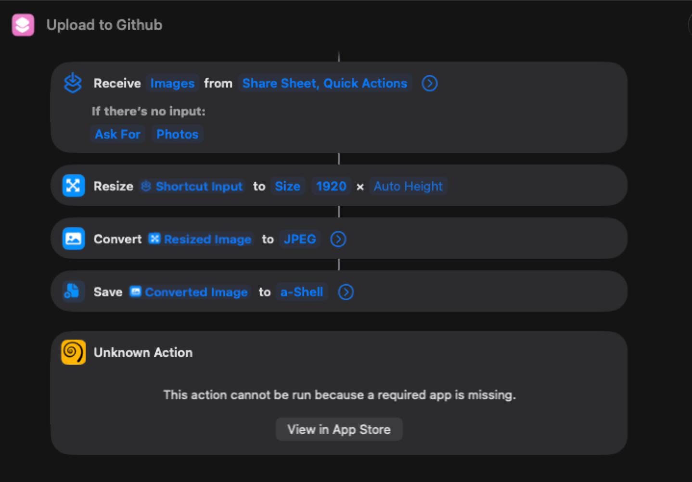

# Photo Management System - Design Document v3.0 FINAL

## SICC Ryder Cup App

---

### Document Information

| Property | Value |
|----------|-------|
| **Document Type** | System Design |
| **Version** | 3.0 FINAL |
| **Date** | 2026-07-09 |
| **Status** | ✅ FINAL - Approved |
| **Purpose** | Define the complete photo management flow with flag-based synchronization and user-first priority |

---

## Table of Contents

1. [Critical Design Changes](#1-critical-design-changes)
2. [Implementation Status](#2-implementation-status)
3. [Overview](#3-overview)
4. [User-First Priority](#4-user-first-priority)
5. [Single Source of Truth: F1](#5-single-source-of-truth-f1)
6. [Photo Flag System](#6-photo-flag-system)
7. [Detailed Flows](#7-detailed-flows)
8. [Device Responsibilities](#8-device-responsibilities)
9. [Flag Logic - Device Decision Matrix](#9-flag-logic---device-decision-matrix)
10. [Hole Save Flow - Correct Order](#10-hole-save-flow---correct-order)
11. [Data Separation](#11-data-separation)
12. [Key Functions](#12-key-functions)
13. [State Management](#13-state-management)
14. [Error Handling & Resilience](#14-error-handling--resilience)
15. [File Modification Summary](#15-file-modification-summary)
16. [Testing Plan](#16-testing-plan)
17. [Common Misunderstandings (FAQ)](#17-common-misunderstandings-faq)
18. [Summary](#18-summary)

---

## 1. Critical Design Changes

**This document supersedes all previous versions.**

| Change | Old Design (v2.0) | New Design (v3.0 FINAL) |
|--------|-------------------|-------------------------|
| **Photo Uploader** | F1 OR F2 (whichever saves first) | **ONLY F1** uploads photos |
| **F2 Photo Source** | GitHub ETag check + upload | Firebase Storage (download only) |
| **F2 Responsibility** | Photo + History | **History record ONLY** |
| **Photo Synchronization** | Listener + `imageUrl` | **Flag-based state machine** |
| **Flag Reset** | Not defined | **F1 resets flags** when all devices confirm download |
| **Default Photo Distribution** | Each device loads independently | **Flag-based**, same as new photo |
| **Photo Check Priority** | During save flow | **After UI update**, in background |
| **Hole Save Order** | UI → WRV → Photo | **UI → User Continues → WRV → Photo** |
| **VIEW Photo Source** | Listener fires → download | Listener OR flag check → download |

---

## 2. Implementation Status

**READ THIS FIRST** - Know what's already done vs what needs to be added.

| # | Component | Status | Location | Notes |
|---|-----------|--------|----------|-------|
| 1 | `loadDefaultCelebrationPhoto()` | ✅ IMPLEMENTED | `celebration-photo.js` | Loads default photo from FS |
| 2 | `storeBlobInSessionStorage()` | ✅ IMPLEMENTED | `celebration-photo.js` v1.12 | Stores blob directly (NO NETWORK) |
| 3 | `downloadPhotoToSessionStorage()` | ✅ IMPLEMENTED | `celebration-photo.js` v1.12 | Downloads from URL to sessionStorage |
| 4 | Flag management functions | ⬜ TO BE ADDED | `celebration-photo.js` | `setPhotoFlags()`, `checkPhotoFlags()`, `resetPhotoFlags()` |
| 5 | `loadDefaultCelebrationPhoto()` flag integration | ⬜ TO BE MODIFIED | `celebration-photo.js` | Must call `setPhotoFlags()` after loading default |
| 6 | `checkAndRenameCelebrationPhoto()` flag integration | ⬜ TO BE MODIFIED | `celebration-photo.js` | Must call `setPhotoFlags()` after upload |
| 7 | `real-game-save.js` - ONLY F1 calls photo check | ⬜ TO BE MODIFIED | `real-game-save.js` | F2 never calls `checkAndRenameCelebrationPhoto()` |
| 8 | `real-game-save.js` - Photo check order | ⬜ TO BE MODIFIED | `real-game-save.js` | Move photo check to AFTER UI update + user continues |
| 9 | F1 flag reset logic | ⬜ TO BE ADDED | `real-game-init.js` | F1 listens and resets when T/T/T |
| 10 | F2 flag check + download | ⬜ TO BE ADDED | `real-game-init.js` | F2 checks flags and downloads if needed |
| 11 | VIEW flag check + download | ⬜ TO BE ADDED | `view-game.html` | VIEW checks flags and downloads if needed |
| 12 | `celebrationData` in `showGameCompleteModal()` | ✅ DONE | `real-game-nav.js` v1.17 | Saved to sessionStorage for post-game.html |
| 13 | GitHub fallback removal | ✅ DONE | `sign-card.js` v1.33 | No fallback - proper management only |
| 14 | `getCelebrationImage()` - sessionStorage only | ✅ IMPLEMENTED | `sign-card.js` | Reads ONLY from sessionStorage |

---

## 3. Overview

### 3.1 System Goals

| Goal | Description |
|------|-------------|
| **User-First Priority** | UI updates immediately. All backend tasks (WRV, photo) happen in background. User never waits. |
| **Single Source of Truth** | ONE photo uploaded by ONE device (F1). All devices download the SAME photo from Firebase Storage. |
| **Flag-Based Synchronization** | Firestore flags ensure every device acknowledges photo download. Default AND new photos use same flow. |
| **Instant Display** | Photos display immediately from sessionStorage (NO network calls at display time). |
| **Resilient** | Flags persist in Firestore. Missed events are recovered on page load. |
| **No Duplicate Work** | F1 handles photo. F2 handles history. No redundant uploads. |

### 3.2 Key Design Principles

| Principle | Description |
|-----------|-------------|
| **User First** | UI updates → User continues → WRV → Photo. Never block the user. |
| **F1 is the Photo Orchestrator** | F1 detects, downloads, uploads, sets flags, and resets flags. |
| **F2 is the History Writer** | F2 downloads photo from FS, writes history record. |
| **VIEW is the Spectator** | VIEW downloads photo from FS, displays celebration. |
| **Flags are the Source of Truth** | Firestore flags track which devices have the photo. |
| **sessionStorage is for Display** | All devices read photos from sessionStorage for instant display. |
| **One Unified Flow** | Default photo AND new photo use the SAME flag-based mechanism. |

### 3.3 Critical Assumptions

| # | Assumption | Why It Matters | What If It Fails? |
|---|------------|----------------|-------------------|
| 1 | Default photo is ALWAYS in Firebase Storage at `celebration/SRC_Default_Photo.jpg` | All devices have a fallback | This is an operational requirement. File must exist. |
| 2 | **ONLY F1** checks GitHub ETag and uploads photos | Prevents redundant uploads and overwrites | Enforced in code. F2 never calls `checkAndRenameCelebrationPhoto()`. |
| 3 | Flags persist in Firestore until F1 resets them | Devices can recover missed events | Flags remain true until acknowledged by all devices. |
| 4 | F1 resets flags ONLY when both F2 and VIEW have confirmed download | Prevents race conditions | F1 checks both flags before resetting. |
| 5 | Photo check happens AFTER UI update and WRV write | User never waits for photo operations | Enforced in code order. |
| 6 | No GitHub fallback in `sign-card.js` | Fallbacks create false security; proper management is better | sessionStorage ALWAYS has a photo (default loaded via flags). |

---

## 4. User-First Priority

### 4.1 The Golden Rule

**The user should NEVER wait for backend tasks.**

| Priority | Task | When | Blocking? |
|----------|------|------|-----------|
| **1** | Save hole → update local cache | Immediate | ❌ NO |
| **2** | Calculate intra-flight, cross-flight, T-x, Strk | Immediate | ❌ NO |
| **3** | **Update UI (renderAll)** | **Immediate** | ❌ NO |
| **4** | **USER CONTINUES PLAYING** | **Immediate** | ❌ NO |
| **5** | WRV write to Firestore | Background | ❌ NO |
| **6** | Photo check (ETag → download → upload → set flags) | Background | ❌ NO |

### 4.2 Why This Order

| If UI Updates First | If WRV/Photo First |
|---------------------|---------------------|
| User sees scores immediately | User waits for backend tasks |
| User continues playing | User experiences lag |
| Backend tasks happen in background | UI is blocked |

### 4.3 The Flow

```
┌─────────────────────────────────────────────────────────────────────────────────────┐
│                          HOLE SAVE FLOW (F1 ONLY)                                  │
├─────────────────────────────────────────────────────────────────────────────────────┤
│                                                                                     │
│  Step 1: User saves hole                                                           │
│         │                                                                          │
│         ▼                                                                          │
│  Step 2: Update local cache (GameData) - IMMEDIATE                                │
│         │                                                                          │
│         ▼                                                                          │
│  Step 3: Calculate intra-flight, cross-flight, T-x, Strk                         │
│         │                                                                          │
│         ▼                                                                          │
│  Step 4: Update UI (renderAll) - IMMEDIATE                                       │
│         │                                                                          │
│         ▼                                                                          │
│  Step 5: USER CONTINUES PLAYING ←────────────────────────────────────────────────┐│
│         │                                                                         ││
│         ▼                                                                         ││
│  Step 6: WRV write to Firestore (BACKGROUND, non-blocking)                      ││
│         │                                                                         ││
│         ▼                                                                         ││
│  Step 7: Photo check (BACKGROUND, non-blocking)                                 ││
│         │                                                                         ││
│         ├── ETag unchanged → skip                                                ││
│         └── ETag changed →                                                       ││
│               ├── Download from GitHub (1-3s, background)                       ││
│               ├── Upload to Firebase Storage (1-3s, background)                 ││
│               ├── Store blob in sessionStorage (NO NETWORK)                     ││
│               └── Set flags T/F/F                                                ││
│                                                                                  ││
│  ⏱️ Total background time: 2-6 seconds (user never waits)                     ││
│                                                                                  ││
└─────────────────────────────────────────────────────────────────────────────────────┘
```

---

## 5. Single Source of Truth: F1

### 5.1 Why F1?

| Reason | Explanation |
|--------|-------------|
| **First to act** | F1 is the first device to save holes and can detect photo changes earliest |
| **Prevents conflicts** | Only one device uploads → no overwrites, no duplicates |
| **Clear responsibility** | F1 = Photo, F2 = History. No confusion. |
| **Auditable** | One upload per photo change, one flag cycle per upload |

### 5.2 Device Responsibilities

| Device | Photo Responsibility | History Responsibility |
|--------|----------------------|----------------------|
| **F1** | ✅ Detects GitHub changes, downloads, uploads to FS, sets flags, resets flags | ❌ NONE |
| **F2** | ✅ Downloads from FS, stores in SS, sets `f2Downloaded = true` | ✅ Writes history record |
| **VIEW** | ✅ Downloads from FS, stores in SS, sets `viewDownloaded = true` | ❌ NONE |

---

## 6. Photo Flag System

### 6.1 Firestore Flags

| Field | Type | Description | Set By | Reset By |
|-------|------|-------------|--------|----------|
| `photo.newPhotoAvailable` | boolean | Set to `true` when F1 uploads new photo | F1 | F1 (when T/T/T) |
| `photo.f2Downloaded` | boolean | Set to `true` when F2 confirms download | F2 | F1 (when T/T/T) |
| `photo.viewDownloaded` | boolean | Set to `true` when VIEW confirms download | VIEW | F1 (when T/T/T) |
| `photo.imageUrl` | string | Firebase Storage URL for download | F1 | F1 (when T/T/T) |
| `photo.updatedAt` | timestamp | When photo was uploaded | F1 | F1 (when T/T/T) |

### 6.2 Flag States

| State | newPhotoAvailable | f2Downloaded | viewDownloaded | Meaning |
|-------|-------------------|--------------|----------------|---------|
| **IDLE** | `false` | `false` | `false` | No new photo. All devices have the same photo. |
| **NEW_PHOTO** | `true` | `false` | `false` | F1 uploaded new photo. Waiting for F2 and VIEW. |
| **F2_DONE** | `true` | `true` | `false` | F2 has downloaded. Waiting for VIEW. |
| **VIEW_DONE** | `true` | `false` | `true` | VIEW has downloaded. Waiting for F2. |
| **ALL_DONE** | `true` | `true` | `true` | All devices have downloaded. F1 will reset. |

### 6.3 Flag Lifecycle

```
IDLE (F/F/F)
    │
    │ F1 has a photo to distribute (default OR new)
    │
    ▼
NEW_PHOTO (T/F/F)
    │
    ├──────────────────────┬──────────────────────┐
    │                      │                      │
    ▼                      ▼                      ▼
F2 downloads           VIEW downloads          F1 ignores
sets f2=T              sets view=T             (already has)
    │                      │                      │
    └──────────────────────┼──────────────────────┘
                           │
                           ▼
F1 sees: newPhotoAvailable=T, f2Downloaded=T, viewDownloaded=T
    │
    ▼
F1 resets ALL flags to false
    │
    ▼
IDLE (F/F/F)
```

### 6.4 One Unified Flow

**Both default photo AND new photo use the SAME flag-based mechanism.**

| Photo Type | Source | Flow |
|------------|--------|------|
| **Default Photo** | `celebration/SRC_Default_Photo.jpg` | F1 loads → sets flags T/F/F → F2/VIEW download → F1 resets |
| **New Photo** | `celebration/{gameId}_H.jpg` | F1 uploads → sets flags T/F/F → F2/VIEW download → F1 resets |

**No special cases. No independent downloads. Everything goes through flags.**

---

## 7. Detailed Flows

### 7.1 Game Start - Default Photo Distribution (F1 ONLY)

| Step | Action | Device | Timing |
|------|--------|--------|--------|
| 1 | Game loads | F1 | T0 |
| 2 | F1 loads default photo from Firebase Storage: `celebration/SRC_Default_Photo.jpg` | F1 | T0+100ms |
| 3 | F1 stores blob in sessionStorage (NO NETWORK) | F1 | T0+500ms |
| 4 | F1 sets flags: `newPhotoAvailable = true`, `f2Downloaded = false`, `viewDownloaded = false` | F1 | T0+500ms |
| 5 | F1 sets `photo.imageUrl` = Firebase Storage URL of default photo | F1 | T0+500ms |
| 6 | F2 listener fires → sees T/F/F → downloads default photo from FS → stores in SS → sets `f2Downloaded = true` | F2 | T0+1000ms |
| 7 | VIEW listener fires → sees T/x/F → downloads default photo from FS → stores in SS → sets `viewDownloaded = true` | VIEW | T0+1000ms |
| 8 | F1 sees T/T/T → resets all flags to F/F/F | F1 | T0+2000ms |

**✅ RESULT:** All devices have the default photo in sessionStorage. Flags reset to IDLE.

### 7.2 During Game - New Photo Detection (F1 ONLY)

| Step | Action | Device | Timing |
|------|--------|--------|--------|
| 1 | F1 saves a hole | F1 | T0 |
| 2 | UI updates immediately (user continues playing) | F1 | T0+100ms |
| 3 | WRV writes hole data to Firestore (background) | F1 | T0+200ms |
| 4 | Photo check starts (background, non-blocking) | F1 | T0+500ms |
| 5 | HEAD request to GitHub for ETag | F1 | T0+700ms |
| 6 | If ETag unchanged → skip (no new photo) | F1 | T0+900ms |
| 7 | If ETag changed → download new photo from GitHub | F1 | T0+900ms |
| 8 | Compress image (canvas.toBlob) | F1 | T0+1500ms |
| 9 | Upload to Firebase Storage: `celebration/{gameId}_H.jpg` | F1 | T0+2500ms |
| 10 | Verify upload with getMetadata() | F1 | T0+3000ms |
| 11 | Store blob directly in sessionStorage (NO NETWORK) | F1 | T0+3000ms |
| 12 | Set flags: `newPhotoAvailable = true`, `f2Downloaded = false`, `viewDownloaded = false` | F1 | T0+3000ms |
| 13 | Set `photo.imageUrl` in Firestore | F1 | T0+3000ms |
| 14 | F2 listener fires → sees T/F/F → downloads from FS → stores in SS → sets `f2Downloaded = true` | F2 | T0+3500ms |
| 15 | VIEW listener fires → sees T/x/F → downloads from FS → stores in SS → sets `viewDownloaded = true` | VIEW | T0+3500ms |
| 16 | F1 sees T/T/T → resets all flags to F/F/F | F1 | T0+4500ms |

**⏱️ TOTAL BACKGROUND TIME:** ~4.5 seconds (user never waits)

**✅ RESULT:** New photo in Firebase Storage. All devices have the new photo in sessionStorage. Flags reset to IDLE.

### 7.3 F2 Photo Download Flow (Listener + Flag Check)

| Step | Action | How |
|------|--------|-----|
| 1 | F2's realtime listener fires (or F2 loads page) | Firestore `onSnapshot()` |
| 2 | F2 reads flag state | `photo.newPhotoAvailable` and `photo.f2Downloaded` |
| 3 | If `newPhotoAvailable = false` → ignore (no new photo) | - |
| 4 | If `newPhotoAvailable = true` AND `f2Downloaded = true` → ignore (already downloaded) | - |
| 5 | If `newPhotoAvailable = true` AND `f2Downloaded = false` → **DOWNLOAD** | `downloadPhotoToSessionStorage(imageUrl)` |
| 6 | Store photo in sessionStorage | `sessionStorage.setItem('celebrationPhoto', base64)` |
| 7 | **Set `f2Downloaded = true`** | Firestore update |
| 8 | Continue with game | - |

### 7.4 VIEW Photo Download Flow (Listener + Flag Check)

| Step | Action | How |
|------|--------|-----|
| 1 | VIEW's realtime listener fires (or VIEW loads page) | Firestore `onSnapshot()` |
| 2 | VIEW reads flag state | `photo.newPhotoAvailable` and `photo.viewDownloaded` |
| 3 | If `newPhotoAvailable = false` → ignore (no new photo) | - |
| 4 | If `newPhotoAvailable = true` AND `viewDownloaded = true` → ignore (already downloaded) | - |
| 5 | If `newPhotoAvailable = true` AND `viewDownloaded = false` → **DOWNLOAD** | `downloadPhotoToSessionStorage(imageUrl)` |
| 6 | Store photo in sessionStorage | `sessionStorage.setItem('celebrationPhoto', base64)` |
| 7 | **Set `viewDownloaded = true`** | Firestore update |
| 8 | Continue with game | - |

### 7.5 F1 Flag Reset Flow

| Step | Action | How |
|------|--------|-----|
| 1 | F1's realtime listener fires | Firestore `onSnapshot()` |
| 2 | F1 reads flag state | `photo.newPhotoAvailable`, `photo.f2Downloaded`, `photo.viewDownloaded` |
| 3 | If `newPhotoAvailable = true` AND `f2Downloaded = true` AND `viewDownloaded = true` | All devices have confirmed |
| 4 | **Reset ALL flags to `false, false, false`** | Firestore update |
| 5 | Log: "Photo flags reset - all devices have the photo" | Console |
| 6 | Wait for next photo change | - |

---

## 8. Device Responsibilities

### 8.1 F1 Device

| # | Responsibility | When | Network? |
|---|----------------|------|----------|
| 1 | Load default photo from FS, store in SS, set flags T/F/F | Game start | ✅ Yes (once) |
| 2 | Check GitHub ETag for photo changes | After UI update + WRV write, in background | ✅ Yes (HEAD request) |
| 3 | Download new photo from GitHub | When ETag changed, in background | ✅ Yes |
| 4 | Compress and upload to Firebase Storage | After download, in background | ✅ Yes |
| 5 | Store blob directly in sessionStorage | After upload | ❌ NO |
| 6 | Set `newPhotoAvailable = true` in Firestore | After upload | ✅ Yes |
| 7 | Set `photo.imageUrl` in Firestore | After upload | ✅ Yes |
| 8 | Monitor flags: `f2Downloaded` and `viewDownloaded` | Continuous (listener) | ✅ Yes |
| 9 | Reset all flags to `false` when T/T/T | When both flags true | ✅ Yes |

### 8.2 F2 Device

| # | Responsibility | When | Network? |
|---|----------------|------|----------|
| 1 | Monitor Firestore for `newPhotoAvailable = true` | Continuous (listener) | ✅ Yes |
| 2 | Download photo from Firebase Storage | When `newPhotoAvailable = true` AND `f2Downloaded = false` | ✅ Yes |
| 3 | Store photo in sessionStorage | After download | ❌ NO |
| 4 | Set `f2Downloaded = true` | After download | ✅ Yes |
| 5 | Write history record | When both signatures signed | ✅ Yes |

### 8.3 VIEW Device

| # | Responsibility | When | Network? |
|---|----------------|------|----------|
| 1 | Monitor Firestore for `newPhotoAvailable = true` | Continuous (listener) | ✅ Yes |
| 2 | Download photo from Firebase Storage | When `newPhotoAvailable = true` AND `viewDownloaded = false` | ✅ Yes |
| 3 | Store photo in sessionStorage | After download | ❌ NO |
| 4 | Set `viewDownloaded = true` | After download | ✅ Yes |

---

## 9. Flag Logic - Device Decision Matrix

### 9.1 F2 Decision Matrix

| newPhotoAvailable | f2Downloaded | Action |
|-------------------|--------------|--------|
| `false` | `false` | **IGNORE** - No new photo |
| `false` | `true` | **IGNORE** - No new photo (should not happen) |
| `true` | `false` | **DOWNLOAD** - New photo, need to download |
| `true` | `true` | **IGNORE** - Already downloaded this photo |

**F2 Logic:**
```javascript
if (newPhotoAvailable === true && f2Downloaded === false) {
    downloadPhotoToSessionStorage(imageUrl);
    set f2Downloaded = true;
} else {
    // Ignore
}
```

### 9.2 VIEW Decision Matrix

| newPhotoAvailable | viewDownloaded | Action |
|-------------------|----------------|--------|
| `false` | `false` | **IGNORE** - No new photo |
| `false` | `true` | **IGNORE** - No new photo (should not happen) |
| `true` | `false` | **DOWNLOAD** - New photo, need to download |
| `true` | `true` | **IGNORE** - Already downloaded this photo |

**VIEW Logic:**
```javascript
if (newPhotoAvailable === true && viewDownloaded === false) {
    downloadPhotoToSessionStorage(imageUrl);
    set viewDownloaded = true;
} else {
    // Ignore
}
```

### 9.3 F1 Reset Decision Matrix

| newPhotoAvailable | f2Downloaded | viewDownloaded | Action |
|-------------------|--------------|----------------|--------|
| `true` | `true` | `true` | **RESET ALL FLAGS TO FALSE** |
| `true` | `true` | `false` | **WAIT** - VIEW hasn't downloaded yet |
| `true` | `false` | `true` | **WAIT** - F2 hasn't downloaded yet |
| `true` | `false` | `false` | **WAIT** - No one has downloaded yet |
| `false` | - | - | **IGNORE** - No new photo |

**F1 Logic:**
```javascript
if (newPhotoAvailable === true && f2Downloaded === true && viewDownloaded === true) {
    // Reset all flags to false
    set newPhotoAvailable = false;
    set f2Downloaded = false;
    set viewDownloaded = false;
    console.log('[F1] Photo flags reset - all devices have the photo');
} else {
    // Wait
}
```

---

## 10. Hole Save Flow - Correct Order

### 10.1 The Golden Rule

**UI Update → User Continues → WRV → Photo Check**

| Order | Task | Priority | Blocking? |
|-------|------|----------|-----------|
| **1** | Save hole → update local cache | **CRITICAL** | ❌ NO |
| **2** | Calculate intra-flight, cross-flight, T-x, Strk | **CRITICAL** | ❌ NO |
| **3** | **Update UI (renderAll)** | **CRITICAL** | ❌ NO |
| **4** | **USER CONTINUES PLAYING** | **CRITICAL** | ❌ NO |
| **5** | WRV write to Firestore (hole data) | Background | ❌ NO |
| **6** | Photo check (ETag → download → upload → set flags) | Background | ❌ NO |

### 10.2 Implementation Pattern

```javascript
// In real-game-save.js

// Step 1-2: Save and update cache
// Step 3-4: Calculate and render UI
// Step 5: User continues playing

// Step 6: WRV write (background, non-blocking)
setTimeout(function() {
    writeConsolidatedPayload(payload, function(err) {
        if (err) {
            console.warn('[SAVE] WRV write failed:', err.message);
        } else {
            console.log('[SAVE] ✅ WRV write completed');
        }
    });
}, 50);

// Step 7: Photo check (background, non-blocking)
// ONLY F1 checks photos
if (editableFlight === 1) {
    setTimeout(function() {
        console.log('[SAVE] 📸 Photo check starting (background)...');
        if (typeof checkAndRenameCelebrationPhoto === 'function') {
            checkAndRenameCelebrationPhoto(gameId, holeNumber, function(err) {
                if (err) {
                    console.warn('[SAVE] Photo check failed:', err.message);
                } else {
                    console.log('[SAVE] ✅ Photo check completed');
                }
            });
        }
    }, 100); // After WRV
}
```

---

## 11. Data Separation

### 11.1 Photo vs. CelebrationData

| Data Type | Storage Key | Set By | Used By | Network? |
|-----------|-------------|--------|---------|----------|
| **Photo** | `sessionStorage.celebrationPhoto` | ALL devices (background) | Celebration screen | NO (at display time) |
| **Photo Flags** | `Firestore.photo.*` | F1 sets, F2/VIEW update | Synchronization | ✅ Yes |
| **celebrationData (scores)** | `sessionStorage.celebrationData` | F1/F2 only (in `showGameCompleteModal()`) | `post-game.html` | NO |
| **celebrationData (VIEW)** | Firestore / cache | VIEW reads directly | VIEW celebration screen | YES (but data is tiny) |

### 11.2 VIEW Does NOT Need celebrationData in sessionStorage

| Question | Answer |
|----------|--------|
| Does VIEW need `celebrationData` in sessionStorage? | **NO.** VIEW reads scores from the cache or Firestore directly. |
| Why? | VIEW is a spectator device. It doesn't navigate to `post-game.html`. |
| What does VIEW display? | Celebration screen with photo (from sessionStorage) and scores (from cache/Firestore). |

### 11.3 F1/F2 Need celebrationData in sessionStorage

| Question | Answer |
|----------|--------|
| Do F1/F2 need `celebrationData` in sessionStorage? | **YES.** When they click "SEE RESULTS", they navigate to `post-game.html`. |
| Why? | `post-game.html` reads `celebrationData` from sessionStorage to display results. |
| When is it saved? | In `showGameCompleteModal()` - before the modal is shown to the user. |
| Where is this implemented? | `real-game-nav.js` v1.17 - `showGameCompleteModal()` function. |

---

## 12. Key Functions

### 12.1 celebration-photo.js - Function Summary (v3.0)

| Function | Purpose | Network? | Called By | Status |
|----------|---------|----------|-----------|--------|
| `loadDefaultCelebrationPhoto()` | Load default photo, store in SS, set flags | ✅ Yes | **F1 ONLY** at game start | ⬜ TO BE MODIFIED |
| `checkPhotoChanged()` | HEAD request to GitHub for ETag | ✅ Yes (cheap) | **F1 ONLY** on hole save | ✅ IMPLEMENTED |
| `checkAndRenameCelebrationPhoto()` | **F1 ONLY** - Download, upload, set flags | ✅ Yes | **F1 ONLY** on hole save | ⬜ TO BE MODIFIED |
| `uploadAndVerifyPhoto()` | Upload to FS with verification | ✅ Yes | F1 (via checkAndRename) | ✅ IMPLEMENTED |
| `storeBlobInSessionStorage()` | Store blob directly in sessionStorage | ❌ NO | F1 (after upload) | ✅ IMPLEMENTED |
| `downloadPhotoToSessionStorage()` | Download from URL to sessionStorage | ✅ Yes | F2, VIEW (when flags true) | ✅ IMPLEMENTED |
| `getPhotoFromSessionStorage()` | Read photo from sessionStorage | ❌ NO | ALL devices (celebration) | ✅ IMPLEMENTED |
| `setPhotoFlags()` | Set photo flags in Firestore | ✅ Yes | F1 (after upload) | ⬜ TO BE ADDED |
| `checkPhotoFlags()` | Read photo flags from Firestore | ✅ Yes | F2, VIEW (listener) | ⬜ TO BE ADDED |
| `resetPhotoFlags()` | Reset photo flags to false | ✅ Yes | F1 (when T/T/T) | ⬜ TO BE ADDED |
| `storeImageInSessionStorage()` | Load from URL and store as base64 | ✅ Yes | Default photo loader | ✅ IMPLEMENTED |

### 12.2 Core Function: setPhotoFlags()

```javascript
/**
 * Set photo flags in Firestore after F1 uploads a new photo
 * Called by F1 only
 *
 * @param {string} gameId - The game ID
 * @param {string} imageUrl - Firebase Storage download URL
 * @param {Function} callback - Called with (err)
 */
function setPhotoFlags(gameId, imageUrl, callback) {
    var db = firebase.firestore();
    var payload = {
        'photo.newPhotoAvailable': true,
        'photo.f2Downloaded': false,
        'photo.viewDownloaded': false,
        'photo.imageUrl': imageUrl,
        'photo.updatedAt': firebase.firestore.FieldValue.serverTimestamp()
    };
    
    db.collection('scheduledGames').doc(gameId).update(payload)
        .then(function() {
            console.log('[CelebrationPhoto] ✅ Flags set: T/F/F');
            if (callback) callback(null);
        })
        .catch(function(err) {
            console.warn('[CelebrationPhoto] ❌ Failed to set flags:', err.message);
            if (callback) callback(err);
        });
}
```

### 12.3 Core Function: resetPhotoFlags()

```javascript
/**
 * Reset photo flags to false
 * Called by F1 only when both f2Downloaded and viewDownloaded are true
 *
 * @param {string} gameId - The game ID
 * @param {Function} callback - Called with (err)
 */
function resetPhotoFlags(gameId, callback) {
    var db = firebase.firestore();
    var payload = {
        'photo.newPhotoAvailable': false,
        'photo.f2Downloaded': false,
        'photo.viewDownloaded': false,
        'photo.updatedAt': firebase.firestore.FieldValue.serverTimestamp()
    };
    
    db.collection('scheduledGames').doc(gameId).update(payload)
        .then(function() {
            console.log('[CelebrationPhoto] ✅ Flags reset: F/F/F');
            if (callback) callback(null);
        })
        .catch(function(err) {
            console.warn('[CelebrationPhoto] ❌ Failed to reset flags:', err.message);
            if (callback) callback(err);
        });
}
```

### 12.4 Core Function: checkPhotoFlags()

```javascript
/**
 * Check photo flags from Firestore
 * Called by F2 and VIEW to determine if a new photo is available
 *
 * @param {string} gameId - The game ID
 * @param {Function} callback - Called with (err, flags)
 */
function checkPhotoFlags(gameId, callback) {
    var db = firebase.firestore();
    
    db.collection('scheduledGames').doc(gameId).get()
        .then(function(doc) {
            if (!doc.exists) {
                callback(new Error('Game not found'), null);
                return;
            }
            
            var data = doc.data();
            var photo = data.photo || {};
            
            var flags = {
                newPhotoAvailable: photo.newPhotoAvailable === true,
                f2Downloaded: photo.f2Downloaded === true,
                viewDownloaded: photo.viewDownloaded === true,
                imageUrl: photo.imageUrl || null,
                updatedAt: photo.updatedAt || null
            };
            
            callback(null, flags);
        })
        .catch(function(err) {
            callback(err, null);
        });
}
```

---

## 13. State Management

### 13.1 Firestore State (Source of Truth for Photo Sync)

| Field | Type | Description | Set By |
|-------|------|-------------|--------|
| `photo.newPhotoAvailable` | boolean | New photo available for download | F1 |
| `photo.f2Downloaded` | boolean | F2 has downloaded the photo | F2 |
| `photo.viewDownloaded` | boolean | VIEW has downloaded the photo | VIEW |
| `photo.imageUrl` | string | Firebase Storage download URL | F1 |
| `photo.updatedAt` | timestamp | When photo was uploaded | F1 |

### 13.2 sessionStorage State (Source of Truth for Display)

| Key | Value | Set By | Used By | When Set |
|-----|-------|--------|---------|----------|
| `celebrationPhoto` | base64 image data | ALL devices | Celebration screen (ALL) | Via flags (default + new) |
| `celebrationData` | JSON (scores, winner, players) | F1/F2 only | `post-game.html` | When "SEE RESULTS" button shown |
| `isPostGame` | "true" | ALL devices | Navigation | When game completes |

### 13.3 localStorage State (Cache for Detection)

| Key | Value | Set By | Used By | Purpose |
|-----|-------|--------|---------|---------|
| `celebration_photo_etag` | GitHub ETag | F1 ONLY | F1 ONLY | Detect photo changes |
| `celebration_photo_size` | GitHub content-length | F1 ONLY | F1 ONLY | Detect photo changes |

---

## 14. Error Handling & Resilience

### 14.1 Failure Scenarios

| Scenario | Recovery | Who Handles |
|----------|----------|-------------|
| **C.jpg not found on GitHub** | Load default photo from FS | F1 (`checkAndRenameCelebrationPhoto()`) |
| **GitHub ETag check fails** | Assume changed (download anyway) | F1 (`checkPhotoChanged()`) |
| **FS upload fails** | Retry 3 times with exponential backoff | F1 (`uploadAndVerifyPhoto()`) |
| **FS verification fails** | Retry upload 3 times | F1 (`uploadAndVerifyPhoto()`) |
| **F2 listener misses flag** | F2 loads page → checks flags → sees T/F → downloads | F2 (on page load) |
| **VIEW listener misses flag** | VIEW loads page → checks flags → sees T/F → downloads | VIEW (on page load) |
| **F2 download fails** | Keep default photo in sessionStorage | F2 (`downloadPhotoToSessionStorage()`) |
| **VIEW download fails** | Keep default photo in sessionStorage | VIEW (`downloadPhotoToSessionStorage()`) |
| **F1 resets flags before F2 downloads** | **CANNOT HAPPEN** - F1 only resets when both flags are true | - |
| **sessionStorage quota exceeded** | Log error, continue with default | All devices |

### 14.2 Retry Logic

| Parameter | Value |
|-----------|-------|
| MAX_UPLOAD_RETRIES | 3 |
| RETRY_BASE_DELAY_MS | 2000 |
| Retry 1 delay | 2s |
| Retry 2 delay | 3s |
| Retry 3 delay | 4.5s |

---

## 15. File Modification Summary

| # | File | Change | Priority | Status |
|---|------|--------|----------|--------|
| 1 | `celebration-photo.js` | Add `setPhotoFlags()`, `resetPhotoFlags()`, `checkPhotoFlags()` | HIGH | ⬜ TO DO |
| 2 | `celebration-photo.js` | Modify `loadDefaultCelebrationPhoto()` to call `setPhotoFlags()` with default URL | HIGH | ⬜ TO DO |
| 3 | `celebration-photo.js` | Modify `checkAndRenameCelebrationPhoto()` to call `setPhotoFlags()` | HIGH | ⬜ TO DO |
| 4 | `real-game-save.js` | **ONLY F1** calls `checkAndRenameCelebrationPhoto()` | HIGH | ⬜ TO DO |
| 5 | `real-game-save.js` | Move photo check to AFTER UI update + user continues (background) | HIGH | ⬜ TO DO |
| 6 | `real-game-init.js` | F2 listener: check flags, download if needed, set `f2Downloaded = true` | HIGH | ⬜ TO DO |
| 7 | `view-game.html` | VIEW listener: check flags, download if needed, set `viewDownloaded = true` | HIGH | ⬜ TO DO |
| 8 | `real-game-init.js` | F1 listener: check T/T/T → reset all flags | HIGH | ⬜ TO DO |
| 9 | `real-game-nav.js` | Add `celebrationData` save in `showGameCompleteModal()` | HIGH | ✅ DONE |
| 10 | `sign-card.js` | GitHub fallback removed | MEDIUM | ✅ DONE |
| 11 | `celebration-photo.js` | `storeBlobInSessionStorage()` | HIGH | ✅ DONE |
| 12 | `celebration-photo.js` | `downloadPhotoToSessionStorage()` | HIGH | ✅ DONE |

---

## 16. Testing Plan

### 16.1 Test Cases

| # | Test | Expected Result | Device |
|---|------|-----------------|--------|
| 1 | New game starts on F1 | F1 loads default → sets flags T/F/F | F1 |
| 2 | New game starts on F2 | F2 sees flags T/F → downloads default from FS | F2 |
| 3 | New game starts on VIEW | VIEW sees flags T/x/F → downloads default from FS | VIEW |
| 4 | F1 sees T/T/T → resets flags | Flags become F/F/F | F1 |
| 5 | C.jpg changes → F1 saves hole | UI updates first, then photo check in background | F1 |
| 6 | F1 ETag changed → downloads → uploads → sets flags T/F/F | Flags set correctly | F1 |
| 7 | F2 listener sees flags T/F | F2 downloads from FS, sets f2Downloaded = true | F2 |
| 8 | VIEW listener sees flags T/x/F | VIEW downloads from FS, sets viewDownloaded = true | VIEW |
| 9 | F1 sees flags T/T/T | F1 resets all flags to F/F/F | F1 |
| 10 | F2 loads page after flag set | F2 checks flags, sees T/F → downloads | F2 |
| 11 | VIEW loads page after flag set | VIEW checks flags, sees T/F → downloads | VIEW |
| 12 | F2 checks flags T/T | F2 ignores (already downloaded) | F2 |
| 13 | VIEW checks flags T/T | VIEW ignores (already downloaded) | VIEW |
| 14 | Game completes → F1 clicks "SEE RESULTS" | Photo displays instantly (from sessionStorage) | F1 |
| 15 | Game completes → F2 clicks "SEE RESULTS" | Photo displays instantly (from sessionStorage) | F2 |
| 16 | Game completes → VIEW clicks "SEE RESULTS" | Photo displays instantly (from sessionStorage) | VIEW |

### 16.2 Console Commands

```javascript
// Check sessionStorage photo
console.log('Photo in sessionStorage:', sessionStorage.getItem('celebrationPhoto') ? '✅' : '❌');

// Check photo size
var photo = sessionStorage.getItem('celebrationPhoto');
if (photo) console.log('Photo size:', (photo.length / 1024).toFixed(1), 'KB');

// Check Firestore flags (run on any device)
var gameId = sessionStorage.getItem('currentGameId');
firebase.firestore().collection('scheduledGames').doc(gameId).get()
    .then(function(doc) {
        var photo = doc.data().photo || {};
        console.log('Flags:', photo);
    });

// Force load default photo (F1 only)
loadDefaultCelebrationPhoto(function(err) {
    console.log('Default photo loaded:', err ? '❌' : '✅');
});

// Check ETag (F1 only)
console.log('ETag:', localStorage.getItem('celebration_photo_etag'));
```

---

## 17. Common Misunderstandings (FAQ)

| # | Question | Answer |
|---|----------|--------|
| 1 | **"Does F2 still check GitHub ETag?"** | **NO.** ONLY F1 checks GitHub ETag. F2 downloads from Firebase Storage. |
| 2 | **"Does F2 still upload photos?"** | **NO.** ONLY F1 uploads photos. F2 handles history records only. |
| 3 | **"How does F2 get the default photo?"** | Via flags. F1 loads default → sets flags → F2 downloads from FS. Same as new photo. |
| 4 | **"How does VIEW get the default photo?"** | Via flags. F1 loads default → sets flags → VIEW downloads from FS. Same as new photo. |
| 5 | **"What if F1 never saves a hole after photo changes?"** | The photo in sessionStorage remains the default photo. When game completes, if no new photo exists, the default photo is used. |
| 6 | **"What if F2 misses the listener event?"** | F2 checks flags on page load. If `newPhotoAvailable = true` and `f2Downloaded = false`, F2 downloads. |
| 7 | **"What if VIEW misses the listener event?"** | VIEW checks flags on page load. If `newPhotoAvailable = true` and `viewDownloaded = false`, VIEW downloads. |
| 8 | **"When does F1 reset the flags?"** | F1 resets flags ONLY when `newPhotoAvailable = true`, `f2Downloaded = true`, AND `viewDownloaded = true`. |
| 9 | **"Does photo check block the user?"** | **NO.** Photo check happens AFTER UI update and AFTER user continues playing. It's background and non-blocking. |
| 10 | **"Does VIEW need celebrationData in sessionStorage?"** | **NO.** VIEW reads scores from cache/Firestore directly. |
| 11 | **"Is the GitHub fallback needed in sign-card.js?"** | **NO.** sessionStorage ALWAYS has a photo (default loaded via flags). |
| 12 | **"Does F2 write the history record?"** | **YES.** F2 is the designated history record writer. F1 does not write history. |

---

## 18. Summary

### 18.1 Key Principles

| Principle | Description | Why It Matters |
|-----------|-------------|----------------|
| **User First** | UI updates → User continues → WRV → Photo | User never waits |
| **F1 is the Single Source** | ONLY F1 detects, downloads, uploads, and sets flags | Prevents conflicts, overwrites, and redundant work |
| **F2 is the History Writer** | F2 downloads photo from FS and writes history | Clear separation of responsibilities |
| **One Unified Flow** | Default AND new photos use SAME flag-based mechanism | No special cases, clean code |
| **Flags are the Synchronization** | Firestore flags track download status | No missed events, no race conditions |
| **sessionStorage is for Display** | All devices read photos from sessionStorage | Celebration screen is INSTANT (NO NETWORK) |
| **No GitHub fallback** | Proper management is better than fallbacks | Fallbacks mask bugs and create false security |

### 18.2 Device Responsibility Summary

| Device | Photo Check | Photo Download | Photo Upload | Flag Set | Flag Reset | History |
|--------|-------------|----------------|--------------|----------|------------|---------|
| **F1** | ✅ (GitHub ETag) | ✅ (from GitHub) | ✅ (to FS) | ✅ (T/F/F) | ✅ (when T/T/T) | ❌ |
| **F2** | ❌ | ✅ (from FS) | ❌ | ✅ (f2=T) | ❌ | ✅ |
| **VIEW** | ❌ | ✅ (from FS) | ❌ | ✅ (view=T) | ❌ | ❌ |

### 18.3 What's Already Working

| Component | Status |
|-----------|--------|
| `loadDefaultCelebrationPhoto()` | ✅ WORKING |
| `storeBlobInSessionStorage()` | ✅ WORKING (NO NETWORK) |
| `downloadPhotoToSessionStorage()` | ✅ WORKING |
| No GitHub fallback in sign-card.js | ✅ WORKING |
| `celebrationData` in `showGameCompleteModal()` | ✅ WORKING (v1.17) |
| Celebration screen reads from sessionStorage | ✅ WORKING |

### 18.4 What Still Needs to Be Done

| # | File | Change | Priority |
|---|------|--------|----------|
| 1 | `celebration-photo.js` | Add `setPhotoFlags()`, `resetPhotoFlags()`, `checkPhotoFlags()` | HIGH |
| 2 | `celebration-photo.js` | Modify `loadDefaultCelebrationPhoto()` to call `setPhotoFlags()` | HIGH |
| 3 | `celebration-photo.js` | Modify `checkAndRenameCelebrationPhoto()` to call `setPhotoFlags()` | HIGH |
| 4 | `real-game-save.js` | **ONLY F1** calls `checkAndRenameCelebrationPhoto()` | HIGH |
| 5 | `real-game-save.js` | Move photo check to AFTER UI update (background) | HIGH |
| 6 | `real-game-init.js` | F2 listener: check flags, download if needed, set `f2Downloaded = true` | HIGH |
| 7 | `view-game.html` | VIEW listener: check flags, download if needed, set `viewDownloaded = true` | HIGH |
| 8 | `real-game-init.js` | F1 listener: check T/T/T → reset all flags | HIGH |

---

I apologize for the confusion. Here is the information reformatted for better clarity and structure:

## Appendix A: iOS Shortcut Setup

### What It Does

* **User Selection**: You select a photo from the iOS Photos app.


* **Processing**: The Shortcut resizes the image to 1920px wide (auto-height) and converts it to JPEG format.


* **Saving**: The file is saved as `C.jpg` in the `a-shell` folder.


* **Trigger**: The process initiates the upload script.


### Required Apps

* **a-shell (iOS app)**: Required for running the script.


### Shortcut Configuration

* **Name**: `Upload Celebration Photo`

* **Actions**:
* **Receive**: Images from the Share Sheet (if no input, it gets the image from the Clipboard).


* **Resize Image**: Width: 1280, Height: Auto.


* **Convert Image**: JPEG.


* **Save File**: Destination is `a-Shell`, and the Path is `Documents/SICC-Ryder-Cup/C.jpg`.


* **Trigger**: Use the Share Sheet extension from the Photos app.



---

## Part 2: a-shell Script Setup

### Location

* `on iPhone (On my iPhone) : ~/Documents/SICC-Ryder-Cup/sync_celebration.sh`

* `on Mac : /Users/piti/Documents/a-shell/sync_celebration.sh`

### Script Content


```bash
#!/bin/sh
# Version: 1.2

# Navigate to your repository folder cleanly
echo "--- Starting Sync Process ---"
echo "Navigating to repository..."
cd ~/Documents/SICC-Ryder-Cup || { echo "ERROR: Could not find repository folder!"; exit 1; }

# Configure local tracking identity cleanly without syntax issues
echo "Configuring git identity..."
printf "[user]\n\tname = Piti Pramotedham\n\temail = piti@pramotedham.com" > .git/config.local
lg2 config include.path config.local

# Fetch the absolute latest history from GitHub
echo "Fetching latest updates from GitHub..."
lg2 fetch origin

# Merge remote changes into your local main branch to resolve the non-fastforward error
echo "Merging remote changes securely..."
lg2 merge origin/main

# Move the capital C.jpg from your Documents folder into the repo images folder
echo "Checking for new image C.jpg..."
if [ -f ~/Documents/C.jpg ]; then
    echo "Found C.jpg. Moving to repository..."
    mv -f ~/Documents/C.jpg ./images/celebration/C.jpg
else
    echo "ERROR: C.jpg not found in Documents folder!"
    exit 1
fi

# Stage, commit, and push up
echo "Staging image for commit..."
lg2 add images/celebration/C.jpg

echo "Committing changes..."
lg2 commit -m "Update celebration photo"

echo "Pushing updates to GitHub..."
lg2 push

echo "--- Sync Complete! ---"

```

### Setup Instructions

1. **Install Required Tools in a-shell**
* Install `gsutil` (Google Cloud Storage CLI): `pip install gsutil`.


* Authenticate: Run `gcloud auth login` (this will open a browser window for you to log in).


2. **Make Script Executable**
* Run the following commands in the terminal:


```bash
cd ~/Documents/SICC-Ryder-Cup
chmod +x sync_celebration.sh

```


3. **Test the Script**
* Execute the script by running: `./upload_celebration.sh`.


---

## END OF DOCUMENT v3.0 FINAL