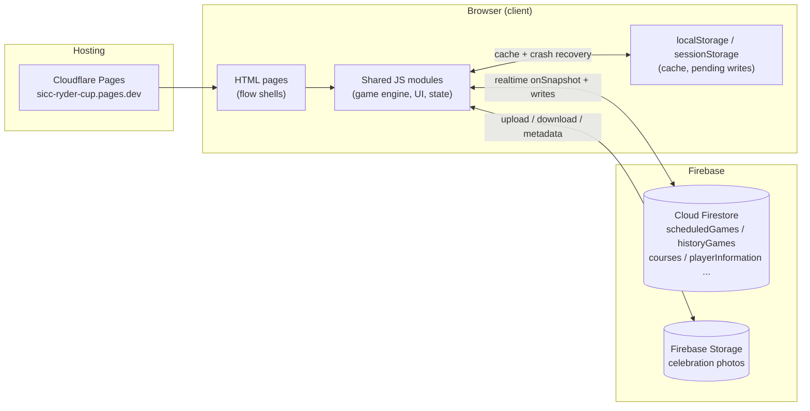
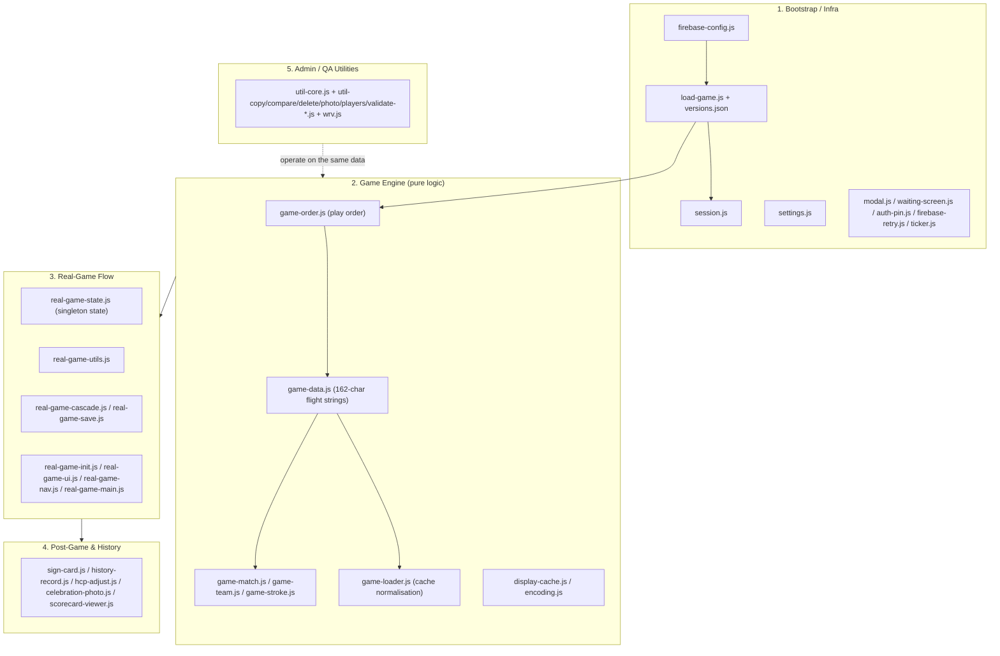
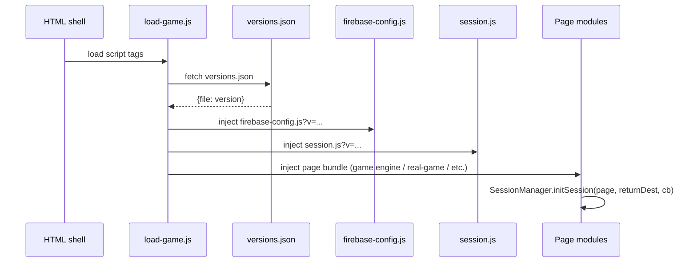
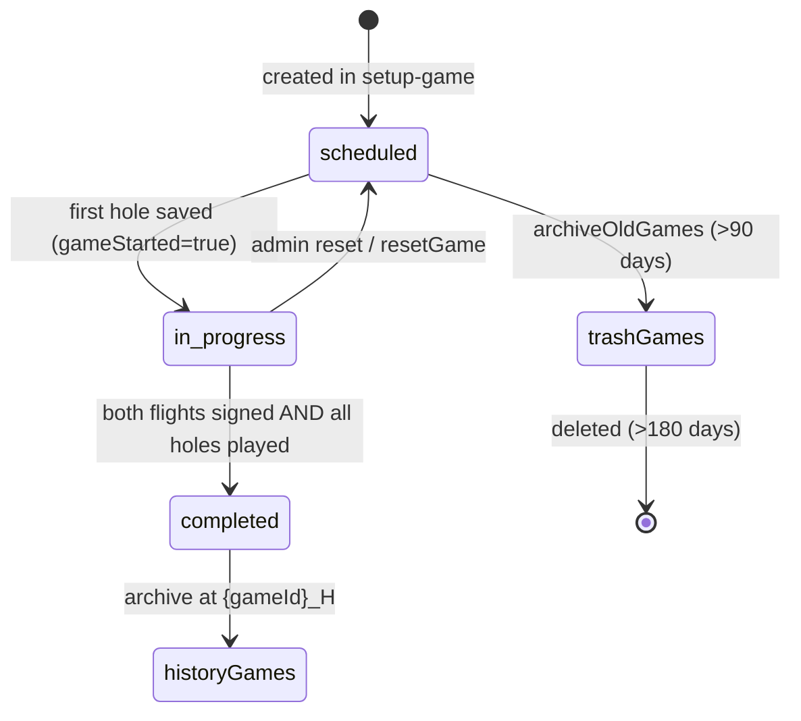
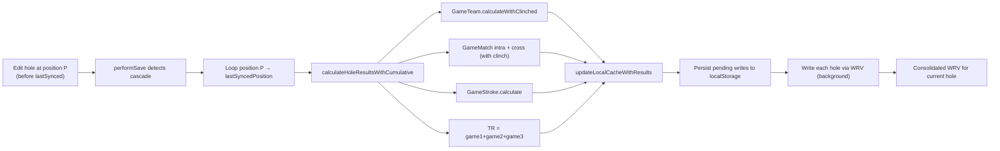
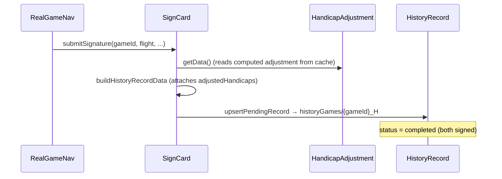
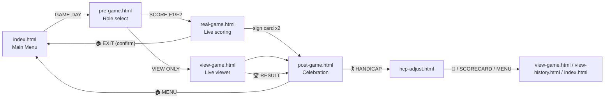
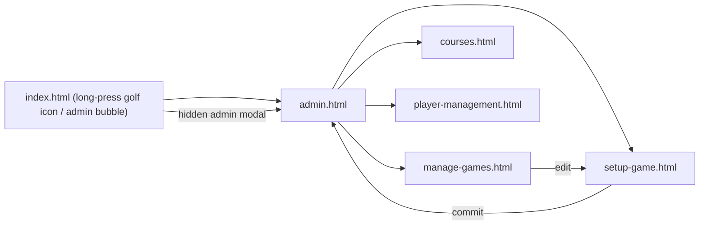
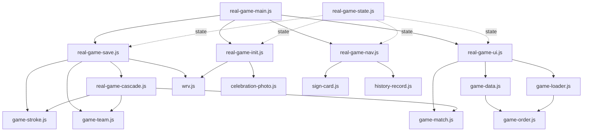

# SICC RYDER CUP — COMPLETE DESIGN DOCUMENTATION

## Document Information
- **Date:** 2026-08-07
- **Version:** 1.0
- **Status:** Master Reference — for future app development
- **Purpose:** Single source of truth describing the architecture, data model, business logic, page/module inventory, key systems, and development conventions of the SICC Ryder Cup app.
- **Companion Documents (original — now ARCHIVED under `Old Version & Resources/`):**
  - `Old Version & Resources/2026-06-30 Game and TR points Definition & Design.md` — original game logic & TR calculations (worked examples)
  - `Old Version & Resources/2026-07-01 Handicap Adjustment Definition & Design.md` — original handicap adjustment rules
  - `Old Version & Resources/2026-07-07 FS Record Structure.md` — original Firestore record schema (v5.0 FINAL)
  - `Old Version & Resources/Photo management/2026-07-09 Photo Management Design - v5.0 FINAL.md` — original celebration photo pipeline (supersedes v1.0–v4.0)
  - `../APP Development Rules.md` — the project's development rules / working agreement

> **⚠️ NOTE FOR FUTURE AI BOTS / DEVELOPERS — document reorganisation (2026-08-07):**
> All original design documents have been **moved into `Old Version & Resources/`** as archived reference material. The `Design Documents` folder now contains **only this file** — `SICC Ryder Cup Complete Design Documentation.md` — which is the **single, authoritative master reference** for the SICC Ryder Cup app.
>
> - **Need the original full text / worked examples?** Read the archived files under `Old Version & Resources/` (exact paths listed above). `Old Version & Resources/` also holds the earlier schema (`2026-06-28 FS Record Structure.md`, v4.0), the `Photo management/` design evolution (v1.0 → v5.0 FINAL), and `2026-07-09 Photo Management Design - v4.0 FINAL.pdf`.
> - **Do NOT treat the archived docs as the living source of truth.** They are reference/history. This document IS the source of truth — update THIS file when the architecture, data model, or conventions change.
> - **Quick check for AI bots:** if a path like `2026-07-07 FS Record Structure.md` is not found at the top level, it was moved — prefix it with `Old Version & Resources/`.

> **How to use this document:** This is the entry point for any developer working on the app. It describes *what exists* and *how the pieces fit together*. For exact field definitions and calculation rules, follow the links to the archived companion documents above.

---

## TABLE OF CONTENTS

1. [Project Overview](#1-project-overview)
2. [System Architecture](#2-system-architecture)
3. [Technology Stack & Environments](#3-technology-stack--environments)
4. [Firestore Data Model](#4-firestore-data-model)
5. [Data Encoding & Identifier Conventions](#5-data-encoding--identifier-conventions)
6. [Core Game Logic](#6-core-game-logic)
7. [Handicap Adjustment System](#7-handicap-adjustment-system)
8. [Page Inventory & User Flows](#8-page-inventory--user-flows)
9. [JS Module Architecture](#9-js-module-architecture)
10. [Key Systems Deep-Dive](#10-key-systems-deep-dive)
11. [QA, Validation & Admin Tooling](#11-qa-validation--admin-tooling)
12. [Development Conventions & Standards](#12-development-conventions--standards)
13. [Future Development Guidelines](#13-future-development-guidelines)
14. [Appendix: Firestore Field Reference](#14-appendix-firestore-field-reference)

---

## 1. PROJECT OVERVIEW

### 1.1 What Is It

The **SICC Ryder Cup** app is a real-time, team-based golf scoring web application used by the Singapore Island Country Club (SICC) members during club match days. It digitises the entire flow of a Ryder-Cup-style inter-club golf match:

1. **Setup** — administrators schedule a game day (date, course, 8 players across 2 teams and 2 flights).
2. **Play** — two flights score their own 18 holes live on separate devices; the app runs **four simultaneous games** (16 individual match-play matches, 2 team games, and 1 stroke game) and computes a combined **Total Results (TR)** score at every hole.
3. **Finish** — captains sign the scorecards, a **handicap adjustment** is computed for every player, a celebration screen/photo is shown, and the game is archived to history.

### 1.2 Core Facts

| Aspect | Value |
|--------|-------|
| Platform | Mobile-first web app (iOS / Android / desktop browser) |
| Frontend | Vanilla HTML + CSS + JavaScript (no framework) |
| Backend | Google **Firebase** (Firestore, Storage) |
| Hosting | Cloudflare Pages (`sicc-ryder-cup.pages.dev`) |
| Data model | Single Firestore "game record" document per game |
| Team structure | 2 teams × 4 players, split into 2 flights of 4 |
| Games running simultaneously | Match Game (16 matches), Team Game T-1, Team Game T-2, Stroke Game |
| Total TR points per hole | **19, always** |
| Concurrency | Multi-device realtime scoring via Firestore `onSnapshot` + per-flight locks |

### 1.3 The Four Games (Summary)

| Game | Scope | TR contribution per hole |
|------|-------|--------------------------|
| **Match Game** | 16 individual matches (each Team A player vs each Team B player) | 16 |
| **Team Game T-1** | Flight 1 two-ball team match | 1 |
| **Team Game T-2** | Flight 2 two-ball team match | 1 |
| **Stroke Game** | Aggregate team stroke play (all 8 players) | 1 |
| **TOTAL** | | **19** |

See [Section 6 — Core Game Logic](#6-core-game-logic) for the full calculation rules, and `Old Version & Resources/2026-06-30 Game and TR points Definition & Design.md` for worked examples.

---

## 2. SYSTEM ARCHITECTURE

### 2.1 High-Level Architecture

The app is a **static single-page-per-flow web app** with a Firebase backend. There is no server-side application logic; all business logic runs in the browser against Firestore, with **Firebase Storage** used for the celebration photo.



### 2.2 Client-Side Layering



### 2.3 Bootstrap Chain (How a Page Starts)

1. The HTML page is a thin shell that loads `load-game.js`.
2. `load-game.js` fetches `js/versions.json`, determines the page from the URL, and injects the correct **script bundle** sequentially, each with `?v=<version>` **cache-busting**.
3. `firebase-config.js` selects PROD vs DEV config by hostname and initialises Firebase.
4. `session.js` (`SessionManager.initSession`) creates/resumes a device session and allocates a short device name.
5. Page-specific init code runs (e.g. `RealGameMain.startGame` for real-game, `init` for index, etc.).



### 2.4 Script Bundles (defined in `load-game.js`)

| Bundle | Scripts |
|--------|---------|
| **coreScripts** (every page) | `firebase-config.js`, `settings.js`, `modal.js`, `waiting-screen.js`, `session.js` |
| **gameEngineScripts** | `game-order.js`, `game-data.js`, `game-match.js`, `game-team.js`, `game-stroke.js`, `game-scorecard.js`, `game-ui.js`, `game-loader.js` |
| **coreGameScripts** | `history-record.js`, `sign-card.js`, `hcp-adjust.js`, `celebration-photo.js`, `ticker.js`, `wrv.js` |
| **realGameScripts** | `real-game-state.js`, `real-game-utils.js`, `real-game-cascade.js`, `real-game-save.js`, `real-game-ui.js`, `real-game-nav.js`, `real-game-init.js`, `real-game-main.js` |
| **viewHistoryScripts** | `firebase-retry.js` |

**Page → bundle mapping:**

| Page | Bundles loaded |
|------|----------------|
| `real-game.html` | core + gameEngine + coreGame + realGame |
| `view-game.html` | core + gameEngine + coreGame |
| `view-history.html` | core + gameEngine + coreGame + viewHistory |
| `post-game.html` | core + coreGame |
| other / unknown | core only |

---

## 3. TECHNOLOGY STACK & ENVIRONMENTS

### 3.1 Stack

| Layer | Technology |
|-------|------------|
| UI | Vanilla HTML5 / CSS3 / JavaScript (ES5-style, IIFE singletons, `window.*` globals) |
| Backend | Firebase (Compat SDK v10.8.0 via CDN: `firebase-app-compat`, `firebase-firestore-compat`, `firebase-storage-compat`) |
| Image rendering | `html2canvas` (CDN) for celebration screenshots |
| Hosting | Cloudflare Pages (`sicc-ryder-cup.pages.dev`) |
| Version control | GitHub (`SICC Ryder Cup - Github Repository`) |

### 3.2 Environments (Two Firebase Projects)

Environment selection is **hostname-driven** (`js/firebase-config.js` v1.02):

| Environment | Firebase Project | Hostname triggers |
|-------------|------------------|-------------------|
| **PROD** | `sicc-ryder-cup` | `sicc-ryder-cup.pages.dev` (and any non-dev host) |
| **DEV / STAGING** | `sicc-ryder-cup-dev` | Cloudflare preview hash URL (`/^[a-f0-9]{7,8}\./`), `staging.sicc-ryder-cup.pages.dev`, `localhost`, `127.0.0.1` |

> The admin utilities (`util-record-management.html`) go one step further and run **both** PROD and DEV apps simultaneously (named apps `"prod"` and `"dev"`, exposed as `window.prodDb` / `window.devDb`) so records can be copied/compared across environments.

### 3.3 Key Configuration Facts

- Firebase auto-init guard: `if (typeof firebase !== 'undefined' && firebase.apps && !firebase.apps.length) firebase.initializeApp(FIREBASE_CONFIG)`.
- `.firebaserc` default project: `sicc-ryder-cup`.
- Celebration artwork default is hosted at `https://sicc-ryder-cup.pages.dev/images/celebration/C.jpg` and synced from the repo (`iOS/sync_celebration.sh` moves a local `~/Documents/C.jpg` into `images/celebration/C.jpg` and commits/pushes).

## 4. FIRESTORE DATA MODEL

### 4.1 Collection Inventory

| Collection | Purpose | Key documents / doc-ID convention |
|------------|---------|------------------------------------|
| `scheduledGames` | Upcoming / in-progress games | Doc ID = `GM_YYMMDD_HHMM_RR`; special doc `MASTER_RECORD` (template) |
| `historyGames` | Completed, archived games | Doc ID = `{gameId}_H` (e.g. `GM_260624_0902_70_H`) |
| `backupFolder` | Auto-backups before record fixes/restores | `BK-YYMMDD-HHMM_<originalId>` or `Backup_YYYYMMDD_HHMMSS_<originalId>` |
| `trashGames` | Purged scheduled games (setup cleanup) | same `GM_...` convention |
| `courses` | Golf courses (name, par[], si[]) | Auto-generated; `DEFAULT_COURSE` seeded when empty |
| `playerInformation` | Player roster + label tracking | Docs: `players`, `defaultPlayers` |
| `deviceMapping` | Device ID → short name (`DEV-01`…) | Doc ID = full device ID; special doc `counter` |
| `deviceSessions` | Active device sessions | Doc ID = `sess_<timestamp>_<random>` |
| `test_wrv` | WRV test-suite scratch (test page) | auto-generated |
| `previewSandboxes` | (Legacy) practice/preview sandboxes | `GM_...` |

### 4.2 Game Record Lifecycle



### 4.3 Game Record Structure (v5.0 FINAL — Summary)

> **Full field-by-field schema:** see `Old Version & Resources/2026-07-07 FS Record Structure.md`. The structure below is the canonical shape maintained by `RealGameUtils.initializeEmptyResults()` / `GameData.initializeEmptyResults()`.

```json
{
  "gameId": "GM_260628_1329_73",
  "gameType": "real",
  "status": "in_progress",
  "date": "2026-06-28",
  "teamGameFormat": "tournament",
  "anchor": "Jeff Goh",
  "startingHole": 1,
  "gameStarted": true,
  "createdAt": "<server timestamp>",
  "updatedAt": "<server timestamp>",
  "lastActive": "<server timestamp>",
  "completedAt": "<server timestamp>",
  "version": 5,
  "schema": "v5_final",

  "course": { "id": "...", "name": "SICC Bukit Course", "par": [4,...], "si": [13,...] },
  "players": [ { "name", "label", "team": "A|B", "flight": 1|2, "handicap" } ],

  "f1": { "d": "<162-char string>", "se": true, "x": false },
  "f2": { "d": "<162-char string>", "se": true, "x": false },

  "locks": { "f1": { "sid", "did", "at", "ex" } | null, "f2": ... | null },
  "currentHoleF1": 1,
  "currentHoleF2": 1,
  "savedHoles": { "1": [1,2,3,...], "2": [1,2,3,...] },
  "lastSyncedPosition": 17,

  "submitted": { "f1": true, "f2": true },
  "signatures": { "f1": { "signed": true }, "f2": { "signed": true } },

  "results": {
    "version": 1,
    "lastComputedAt": "<timestamp>",
    "computedUpToHole": 18,
    "matchResults": { "0": [16 ints], ... , "17": null },
    "f1IntraMatches": { "0": { "A_vs_B": 1 }, ... },
    "f2IntraMatches": { ... },
    "game1": { "pointsA": [8 x 18], "pointsB": [8 x 18] },
    "game2": {
      "flight1": { "leader": [...], "cumulativePoints": [...], "clinchedHole": 18 },
      "flight2": { ... },
      "pointsA": [1 x 18], "pointsB": [1 x 18],
      "displayT1": [...], "displayT2": [...]
    },
    "game3": {
      "leader": [...], "nettA": [...], "nettB": [...],
      "pointsA": [0.5 x 18], "pointsB": [0.5 x 18], "displayStrk": [...]
    },
    "tr": {
      "teamA": [11.5, ...], "teamB": [7.5, ...],
      "teamAGreen": [...], "teamBGreen": [...]
    },
    "clinchedAt": { "Winner_vs_Loser": { "winner", "loser", "clinchedAtHole", "leadAtClinch", "remainingHolesAtClinch", "cascadeVersion", "recordedAt", "recordedByDevice" } },
    "playerTotals": { "<name>": { "name", "label", "holesPlayed", "totalGross", "totalPar", "relativeToPar" } }
  },

  "adjustedHandicaps": {
    "calculatedAt": "<timestamp>",
    "anchor": "Jeff Goh",
    "newAnchor": "Jeff Goh",
    "needsZeroRise": false,
    "zeroRiseAmount": 0,
    "players": [ { "name", "label", "startingHcp", "anchorAdj", "perfAdj", "finalHcp", "anchorRaw", "perfRaw" } ]
  },

  "celebration": { "imageRef": "celebration/GM_..._H.jpg", "imageUrl": "...", "copiedAt": "<timestamp>" },
  "photo": { "newPhotoAvailable": bool, "f2Downloaded": bool, "viewDownloaded": bool, "imageUrl": "...", "updatedAt": "<ts>" },

  "finalResults": { "teamAScore": 7.5, "teamBScore": 11.5, "winner": "B", "winnerText": "Team B Wins!" }
}
```

### 4.4 Supporting Documents

**`playerInformation/players`** (player roster & label tracking):

```json
{
  "players": [ { "name", "label", "handicap", "defaultTeam": "A|B", "flight": 1|2, "isDefault": true, "lastLabelChange": "<date>" } ],
  "usedLabels": { "ACH": true, "KF": true, ... },
  "labelHistory": { "OLD_LABEL": "NEW_LABEL", ... },
  "updatedAt": "<server timestamp>"
}
```

**`playerInformation/defaultPlayers`** — stores `usedLabels` (merged, never replaced) and default roster used by setup.

**`courses/<id>`:**

```json
{ "name": "SICC Island Course", "par": [5,3,4,...], "si": [1,11,3,...], "createdAt": "..." }
```

**`deviceSessions/<sessionId>`:**

```json
{
  "sessionId", "deviceId", "createdAt", "lastActive",
  "currentPath", "returnDestination",
  "navigationHistory": [ { "page", "timestamp", "action" } ],
  "activeGame": { "gameId", "gameType", "gameMode", "role", "collection" }
}
```

**`deviceMapping/<deviceId>`:**

```json
{ "shortName": "DEV-01", "deviceId": "...", "createdAt": "...", "lastSeen": "..." }
```

**`deviceMapping/counter`** — `{ "lastNumber": 12 }` for sequential DEV-NN allocation.

### 4.5 Key Design Constraints

1. **No nested arrays** — Firestore does not support arrays-of-arrays. Match results (`matchResults`, `f1IntraMatches`, `f2IntraMatches`) are stored as **position-keyed objects** (`"0"`, `"1"`, … `"17"`), not arrays of arrays.
2. **Compact raw data** — hole-by-hole gross scores are stored as **162-character strings** (see Section 5), keeping the flight document small and cheap to sync.
3. **Derived data is stored** — computed results (TR, T-1/T-2/Strk, clinches) are written to `results.*` alongside the raw data so viewers render instantly without recalculation.
4. **Deterministic archive IDs** — history docs always use `{gameId}_H`, so re-archiving **overwrites** rather than duplicates.
5. **Backwards compatibility** — schema versions (`version`, `schema` fields) and explicit migration code (e.g. legacy flat signature fields → nested; legacy result arrays → objects) keep old records readable.

---

## 5. DATA ENCODING & IDENTIFIER CONVENTIONS

### 5.1 Flight Data String (162 characters) — owned by `game-data.js`

Each flight's 18-hole gross scores are stored as **18 blocks × 9 chars**.

```
Position: 0  1  2  3  4  5  6  7  8
         T  0  5  0  7  0  8  0  4
         │  │  │  │  │  │  │  │  └─ Team B player 2 (B2) gross, 2 digits
         │  │  │  │  │  │  │  └──── Team B player 1 (B1) gross, 2 digits
         │  │  │  │  │  │  └─────── Team A player 2 (A2) gross, 2 digits
         │  │  │  │  │  └────────── Team A player 1 (A1) gross, 2 digits
         │  │  │  │  └───────────── Saved flag: 'T' = saved, 'F' = free/not saved
         │  │  │  └──────────────── Hole number (implied by position)
         │  │  └─────────────────── unused
         │  └────────────────────── unused
         └───────────────────────── start marker
```

- Example: `T05070804` → saved hole, A1=5, A2=7, B1=8, B2=4.
- Default/empty block: `F04040404` (par values padded to 2 digits).
- **Shotgun start:** the 18 blocks are **rotated** so play begins at `startingHole`. Block order = **play order (positions 0–17)**.
- `GameData.getSavedHolesFromString()` walks the string and collects the natural hole numbers whose block starts with `T`.
- Stored at `f1.d` / `f2.d` (nested) or `f1DataString` / `f2DataString` (history/flat legacy).

### 5.2 Display Cache String (594 characters) — owned by `display-cache.js`

A compact, versioned snapshot of *derived display data* for all 18 holes: **33 chars/hole**.

| Offset (within hole) | Content | Encoding |
|----------------------|---------|----------|
| 0–3 | Flight 1 player relative scores (4 players) | `-10..15 → A..Z` (K=0) |
| 4–7 | Flight 2 player relative scores | A–Z |
| 8–23 | 16 match bubble values | A–Z |
| 24–25 | TR Team A | `0..19 → A..T`, `*` = +0.5 |
| 26–27 | TR Team B | A–T + `*` |
| 28–29 | TR colours | `GG` / `GR` / `RG` / `RR` |
| 30–32 | T-1, T-2, Strk display rows | `A` / `B` / `S`(=AS) |

- Empty cache = all `"K"` (all relative scores 0).
- `encoding.js` provides the same mapping tables for history strings (overlapping legacy module).

### 5.3 Identifier Conventions

| Identifier | Format | Example | Notes |
|------------|--------|---------|-------|
| Game ID | `GM_YYMMDD_HHMM_RR` | `GM_260628_1329_73` | RR = 2-digit random/sequence |
| History archive ID | `{gameId}_H` | `GM_260624_0902_70_H` | Restored copies append `_R` → `..._H_R` |
| Backup ID | `BK-YYMMDD-HHMM_<originalId>` | `BK-260708-0915_GM_...` | older style `Backup_YYYYMMDD_HHMMSS_<id>` |
| Session ID | `sess_<epochMs>_<random12>` | `sess_1782627593477_mjbfyzs367` | |
| Device ID | `dev_<epochMs>_<random8>` | `dev_..._ab12cd34` | |
| Short device name | `DEV-NN` | `DEV-01` … `DEV-99` | allocated via `deviceMapping/counter` |
| Celebration photo | `celebration/{gameId}_H.jpg` | `celebration/GM_260606_1010_13_H.jpg` | |
| Match clinch key | `{Winner}_vs_{Loser}` | `Ang Cheng Hoo_vs_Jeff Goh` | **labels** after v1.40 normalisation |
| Intra-match keys | `{PlayerA}_vs_{PlayerB}` (alphabetical) | `Kenneth Foo_vs_Piti Pramotedham` | |

## 6. CORE GAME LOGIC

> **Authoritative rules & worked examples:** `Old Version & Resources/2026-06-30 Game and TR points Definition & Design.md`. This section summarises the rules and maps them to the code.

### 6.1 Team & Flight Setup

- **8 players:** Team A (4) vs Team B (4).
- **2 flights:** Flight 1 = A1, A2, B1, B2 · Flight 2 = A3, A4, B3, B4.
- Within each flight, players are **ordered by handicap (lowest → highest)**. This ordering drives all match pairings:
  - A1 vs B1, A1 vs B2, A2 vs B1, A2 vs B2 (and A3/A4 vs B3/B4).
- **Anchor** = player with lowest handicap (0 after zero-rise); selectable at setup when ties exist.

### 6.2 Handicap Stroke Allocation (Match & Team Games)

- Strokes are allocated by **Stroke Index (SI)** of the course, **not** hole number.
- A player's strokes at a hole = 1 if `SI(hole) ≤ handicap` (or handicap difference), else 0.
- `GameMatch.getStrokeHoles(handicapDiff, courseSi)` sorts holes 1–18 by SI ascending and returns the first `handicapDiff` holes.

### 6.3 Match Game (16 matches) — `game-match.js`

- Every Team A player plays every Team B player (16 matches).
- **Cross-flight** matches: 16 in `results.matchResults[position][0..15]` (index = `aIndex * teamBPlayers.length + bIndex`).
- **Intra-flight** matches: 4 per flight, stored in `results.f1IntraMatches[position]` / `f2IntraMatches[position]` (also used by the team game).
- Per hole, per match, from Team A's point of view: net lower → **+1**; net higher → **−1**; tie → **0.5**.
- Match contribution to TR: based on the **cumulative running score** — winning → 1/0, AS → 0.5/0.5, losing → 0/1.
- **16 TR points per hole total** from the match game.

### 6.4 Team Game (T-1, T-2) — `game-team.js`

- Per flight, two sub-matches per hole: **Best Net** and **2nd Best Net** (each team).
- Two handicap modes (selected at setup): **Tournament** (full handicap) and **Relative** (handicap − flight anchor).
- Hole contribution = BN result + 2BN result (each ±1/0) → running total.
- Display: `A<n>` / `B<n>` / `AS`.
- TR from team game = 1 point per flight per hole → **2 total**.
- **Team clinch:** when `|cumulativeLead| > remainingHoles * 2` (each hole worth 2 points per flight); recorded as `clinchedHole` on the flight.

### 6.5 Stroke Game — `game-stroke.js`

- Compares cumulative **team net** scores: `netA = cumGrossA − sum(team A handicaps)`, `netB = ...`.
- Display: `A<n>` / `B<n>` / `AS` (margin = rounded difference).
- TR: leader → 1/0, AS → 0.5/0.5 → **1 point per hole**.

### 6.6 Total Results (TR)

```
TR Team A[hole] = MatchGame A[hole] + T-1 A[hole] + T-2 A[hole] + Stroke A[hole]
TR Team B[hole] = 16 − TR Team A[hole]   (i.e. total is always 19)
```

Validation rule: `TR A + TR B = 19` at every hole. Stored in `results.tr.teamA`, `teamB`, `teamAGreen`, `teamBGreen`.

### 6.7 Clinch Detection — `game-match.js`

A match is clinched when one player's lead exceeds the number of remaining holes:

```
if (Math.abs(matchValue) > remainingHoles && matchValue !== 0)  → clinched
```

Recorded in `results.clinchedAt` keyed `{Winner}_vs_{Loser}` with `clinchedAtHole`, `leadAtClinch`, `remainingHolesAtClinch`, `cascadeVersion`, `recordedAt`, `recordedByDevice`.

### 6.8 Cascade Recalculation — `real-game-cascade.js`

When a scorer **edits an earlier hole** (before `lastSyncedPosition`), all downstream holes must be recomputed:



- Pending writes are stored under `localStorage["pendingCascade_{gameId}"]` (1-hour TTL) for crash recovery, and resumed by `RealGameInit.init` → `processPendingWrites`.
- UI is updated **once** after the whole cascade completes (not per hole).

### 6.9 Last-Sync Tracking

- `lastSyncedPosition` = highest play position where **both** flights have the hole saved.
- Used to decide whether a save triggers a cascade, and to grey out unsynced match bubbles.

---

## 7. HANDICAP ADJUSTMENT SYSTEM

> **Authoritative rules & worked examples:** `Old Version & Resources/2026-07-01 Handicap Adjustment Definition & Design.md`. Implemented in `hcp-adjust.js` (engine) and triggered by `sign-card.js` at signing.

### 7.1 Overview

At the end of each game, every player's handicap is adjusted based on:

1. **Anchor Adjustment (Anc)** — result of an imaginary 18-hole match against the Anchor (lowest-handicap player).
2. **Performance Adjustment (Perf)** — result of the player's 4 match-play games.

```
finalHcp = startingHcp + anchorAdj + perfAdj
```

### 7.2 Anchor Adjustment

- Per hole, compare net scores vs the Anchor (strokes by SI based on handicap difference).
- `netWon = playerWon − anchorWon` over 18 holes.
- **Adjustment = `Math.floor(|netWon| / 2)`** — negative (CUT, red) if the player beat the Anchor; positive (ADD, green) if lost.

| netWon | anchorAdj | Meaning |
|--------|-----------|---------|
| +4 | −2 | Beat anchor by 4 → CUT 2 |
| +2 / +3 | −1 | CUT 1 |
| −1 / 0 / +1 | 0 | No change |
| −2 / −3 | +1 | ADD 1 |
| −5 | +2 | ADD 2 |

### 7.3 Performance Adjustment

- Perf raw = points from 4 matches: Win = 1, AS = 0.5, Loss = 0 (range 0–4).

| perfRaw | perfAdj |
|---------|---------|
| ≥ 3.5 | −1 (CUT, red) |
| 0.6 – 3.4 | 0 |
| ≤ 0.5 | +1 (ADD, green) |

### 7.4 Zero-Rise

If the lowest final handicap is not 0, shift **all** players up by `−lowest` so the lowest becomes 0. The Anchor stays at 0 by definition.

### 7.5 Multiple Anchors

- Multiple 0-handicap players can exist. The Anchor is selected at **Setup Game** (stored in the record's `anchor` field).
- At the adjustment table a **"Change Anchor"** button recalculates all adjustments against a newly selected 0-handicap player.
- If several players end at 0 after zero-rise, `newAnchor = "*multiple*"` (pending selection).

### 7.6 Data Flow at Signing



> `hcp-adjust.html` is a **display-only** page: the full handicap payload is written once at F2 signing time via `sign-card.js`.

## 8. PAGE INVENTORY & USER FLOWS

### 8.1 Page Inventory

All 18 pages live at the repo root. Every page follows the shared design language (dark theme, green accents, max-width 500px container, `safe-area-inset` padding, `.version-tag` top-right, `.device-tag` top-left, localStorage version cache-buster).

| Page | Version (ref) | Role | Purpose |
|------|---------------|------|---------|
| `index.html` | 3.67 | Home | Main menu, splash animation, GAME DAY / NEXT GAME / PREVIOUS GAMES / DEMO / SETTINGS |
| `pre-game.html` | 3.28 | Game day | "READY TO PLAY" — verify lineup, select role (Score F1 / Score F2 / View Only), TEE OFF; supports `?mode=preview` |
| `real-game.html` | 6.25 | Game day | Live scoring shell — all logic loaded dynamically by `load-game.js` |
| `view-game.html` | 8.16 | Game day | Read-only live viewer (VIEW ONLY role / post-game review) with realtime listener |
| `post-game.html` | 1.13 | Post-game | Instant celebration screen from `sessionStorage.celebrationData` |
| `hcp-adjust.html` | 1.40 | Post-game | Display-only handicap adjustment table |
| `view-history.html` | 8.51 | History | List + view completed games (scorecards, handicap, photos, label resolution) |
| `admin.html` | 1.20 | Admin | Admin hub ("Game Settings"), pinch-zoom toggle, hidden duplicate-master function |
| `setup-game.html` | 1.62 | Admin | Create/edit scheduled games (date, course, starting hole, format, 8 players, anchor) |
| `manage-games.html` | 1.30 | Admin | Manage scheduled games — edit / delete (PIN) / copy to new date |
| `courses.html` | 1.37 | Admin | Course CRUD (name, per-hole Par + SI) |
| `player-management.html` | 1.21 | Admin | Player CRUD with label uniqueness + 12-month cooldown |
| `util-record-management.html` | 1.35 | Dev/QA | 6-tab admin console: COPY / COMPARE / VALIDATE / PLAYERS / PHOTO / DELETE |
| `validate.html` | 2.07 | Dev/QA | Full game-data validator & repair (Tab1 restore, Tab2 validate & fix) |
| `validate-new-record.html` | 1.00 | Dev/QA | Structural validator for new empty setup-game records |
| `test-wrv.html` | 1.00 | Dev/QA | WRV write-read-verify test suite |
| `test-celebration.html` | 1.08 | Dev/QA | Celebration photo load/crop/fullscreen test |
| `tutorial.html` | 1.26 | Onboarding | 9-step interactive demo & tutorial |

### 8.2 Main Game-Day Flow



### 8.3 Admin & Setup Flow



### 8.4 Key Page Details

**`index.html`**
- First-load animated splash (drop + spin + haptics), 4-second display, once per session; non-first-load grey icon screen.
- **GAME DAY** checks completion: if both signatures signed → `post-game.html?gameId=`; else → `pre-game.html`.
- **NEXT GAME** (v3.67) → `pre-game.html?mode=preview` (view-only preview of the next scheduled game).
- Background preload of game data into `sessionStorage.preloadedRawGameData` (5-min TTL) for fast real-game render.
- Custom pull-to-refresh (web-app mode) reloads data.
- Hidden admin: Cmd/Ctrl+Click, double-click, or 800ms long-press on the golf icon → `showAdminModal` (Duplicate Master Record / Manage All Games / Refresh).

**`pre-game.html`**
- Loads the game + realtime lock listener; shows flights, teams, handicaps, anchor (orange highlight).
- Role selection: **Score F1 / Score F2 / View Only**, with lock awareness and takeover modal (6h lock duration).
- **TEE OFF** → writes lock + `gameStarted=true` → `real-game.html` (F1/F2) or `view-game.html` (view).
- Admin modal: Reset Locks (preserve scores) / Reset Game (full, destructive) / View Game Data / Refresh.
- Preview mode: role buttons disabled, TEE OFF hidden, "📋 NEXT GAME" title.

**`real-game.html`**
- Thin shell; `load-game.js` dynamically loads the full game engine + real-game modules.
- UI elements: ticker, status bubble (LIVE), hole header, flight tab, TR billboard, player cards with match bubbles, scorecard, bottom menu, save button.
- All scoring/saving logic is in `js/real-game-*.js` (see Section 10).

**`setup-game.html`**
- Create (v1.62) or edit (`?mode=edit`) games; validates date, team/flight balance (2A/2B per flight).
- **Latest handicaps** auto-loaded from `historyGames` per label (v1.60).
- Anchor selection modal (when multiple 0-handicap players).
- Creates the full record (rotated f1/f2 strings, empty results, nested signatures, locks, `gameStarted:false`).
- Edit commit requires PIN (`AuthPin.requireAuth('update', ...)`); dirty-tracking with unsaved-changes modal.
- `archiveOldGames()` — scheduled games >90 days → `trashGames`; trash >180 days deleted.

**`player-management.html`**
- Player CRUD; label auto-generation (≤3 chars, uppercase); real-time label validation:
  - max 3 chars, non-empty, not used by another active player,
  - not in historical `usedLabels`,
  - **12-month cooldown** on label change (`lastLabelChange`).
- Label history (`oldLabel → newLabel`) maintained in `playerInformation/players.labelHistory`.

### 8.5 Record ID & Navigation Conventions

- Every page calls `SessionManager.initSession(<page>, <returnDestination>, cb)` which records navigation history and the return destination.
- Context-aware back links: admin pages return to `admin.html`; edit-mode setup returns to `manage-games.html`.
- Post-game / history navigation always carries `?gameId=` (and `?mode=readonly|history` for hcp-adjust).

---

## 9. JS MODULE ARCHITECTURE

### 9.1 Module Inventory by Layer

| Layer | Module (version) | Responsibility |
|-------|------------------|----------------|
| **Infra** | `firebase-config.js` (1.02) | PROD/DEV config selection + auto-init |
| | `load-game.js` (1.03) | Sequential script loader, version bundles |
| | `session.js` (1.01) | `SessionManager` — device sessions, short names, active game |
| | `settings.js` (1.00) | `AppSettings` — zoom on/off persisted setting |
| | `versions.json` (1.02) | Version manifest for cache-busting |
| **UI singletons** | `modal.js` (1.03) | Confirm/alert/custom/three-button/game-complete modals |
| | `waiting-screen.js` (1.00) | Full-screen grey ⛳ overlay during writes |
| | `auth-pin.js` (2.08) | 4-digit PIN gate (5 attempts, 30s lockout, 5-min session) |
| | `firebase-retry.js` (1.01) | Read retries w/ exponential backoff + NO INTERNET modal |
| | `ticker.js` (1.03) | Scrolling live score ticker |
| **Game engine** | `game-order.js` (1.00) | Shotgun-start play order (positions 0–17) — single source of truth |
| | `game-data.js` (4.13) | 162-char flight strings, hole parse/update, save orchestration, empty-results |
| | `game-loader.js` (1.17) | Firestore read + cache normalisation, subscribe, refresh |
| | `game-match.js` (2.28) | Match game + clinch detection + bubble classes |
| | `game-team.js` (1.13) | Team game T-1/T-2 + team clinch |
| | `game-stroke.js` (1.09) | Stroke game |
| | `game-scorecard.js` (1.19) | 18-hole scorecard table renderer |
| | `game-ui.js` (5.10) | Shared UI library (bubbles, cards, header, TR, bottom menu) |
| | `display-cache.js` (1.00) | 594-char display cache encode/decode |
| | `encoding.js` (1.01) | Legacy encode/decode mappings (overlaps display-cache) |
| **Real-game** | `real-game-state.js` (1.02) | Singleton in-memory state store |
| | `real-game-utils.js` (1.01) | Play-order delegation, empty-results, player totals, structure migration |
| | `real-game-cascade.js` (1.02) | Per-hole recomputation engine |
| | `real-game-save.js` (1.42) | Save pipeline, cascade, consolidated WRV writes, pending-write recovery |
| | `real-game-init.js` (1.16) | Bootstrap, realtime listener, lock check, photo flags, exit |
| | `real-game-ui.js` (1.08) | Real-game screen rendering + save-button states |
| | `real-game-nav.js` (1.18) | Hole navigation, sign-card flow, modals, history handoff |
| | `real-game-main.js` (1.00) | Orchestrator / entry point (auto-starts on DOM ready) |
| **Post-game** | `sign-card.js` (1.40) | Celebration screen, history save, clinchedAt label normalisation |
| | `history-record.js` (3.11) | History persistence (`{gameId}_H`) + handicap update |
| | `hcp-adjust.js` (2.65) | Handicap adjustment engine |
| | `celebration-photo.js` (1.21) | Photo pipeline (upload, sync flags, session storage) |
| | `scorecard-viewer.js` (1.04) | Config-driven read-only viewer |
| | `card-submit.js` (1.01) | Scorecard submission flags (`submitted.f1/f2`) + final results |
| | `used-labels.js` (1.01) | usedLabels index (stored in `playerInformation/defaultPlayers`) |
| | `wrv.js` (1.14) | **Write-Read-Verify** verified writes + recovery |
| **Hidden admin** | `index-hidden.js` (1.08) | Today's game ID display, MASTER_RECORD duplication, admin modal |
| **Tutorial** | `tutorial-scoring.js` / `tutorial-results.js` / `tutorial-postgame.js` (1.00) | 9-step tutorial steps 2–4, 5–6, 7–9 |
| **Admin/QA utils** | `util-core.js` (1.02) | Dual-env Firebase init, shared log system, helpers |
| | `util-copy-record.js` (1.06) | COPY tab |
| | `util-compare-record.js` (1.05) | COMPARE tab |
| | `util-validate-app.js` / `util-validate-record.js` / `util-validate-ui.js` | VALIDATE tab (controller / engine / UI) |
| | `util-players.js` (1.07) | PLAYERS tab (usedLabels rebuild, labelHistory sync, player editor) |
| | `util-photo.js` (1.16) | PHOTO tab (load/upload/storage list/delete) |
| | `util-delete-record.js` (1.11) | DELETE tab + device cleanup |

### 9.2 Module Pattern & Conventions

- **Singleton IIFE** pattern: `var X = (function(){ ... return {api}; })();` exposed as `window.X`.
- **Version exposure:** every module sets a `window.<NAME>_VERSION` global for console debugging (e.g. `GAME_MATCH_VERSION`, `REAL_GAME_SAVE_VERSION`).
- **File headers/footers:** every file begins and ends with a comment block (FILE / VERSION / KEY CHANGES / DEPENDS ON / STATUS). See Section 12.
- **Shared-code isolation rule:** any feature used by more than one HTML page must live in a standalone `.js` file — never duplicated inline in HTML.

### 9.3 Core Dependency Web (real-game)



### 9.4 localStorage / sessionStorage Usage

| Storage | Key | Owner | Purpose |
|---------|-----|-------|---------|
| localStorage | `deviceId` | session.js | Persistent device identity |
| localStorage | `shortDeviceName` | session.js | Cached DEV-NN name |
| localStorage | `sessionId` | session.js | Current session id |
| localStorage | `app_settings` | settings.js | `{enableZoom: bool}` |
| localStorage | `scorecardDisplay` | game-ui.js | `"play"` / `"natural"` display mode |
| localStorage | `userRole` | real-game-init.js | Role (removed on exit) |
| localStorage | `pendingCascade_{gameId}` | real-game-save.js | Crash-recovery queue |
| localStorage | `celebration_photo_etag` / `celebration_photo_size` | celebration-photo.js | GitHub artwork change detection |
| localStorage | `celebration_photo_etag_firebase` | celebration-photo.js / real-game-init.js | Shared Firebase Storage ETag |
| localStorage | `celebration_photo_url_{gameId}` | celebration-photo.js | Photo URL for history |
| localStorage | `appLogs` | util-core.js | Admin log persistence (last 2000) |
| localStorage | `delete_custom_collections`, `delete_last_collection` | util-delete-record.js | DELETE tab prefs |
| sessionStorage | `sessionId`-linked game cache | various | `gameCache`, `preloadedRawGameData`, `celebrationData`, `isPostGame`, `currentGameId`, `editGameData`, `lastHistoryArchiveId`, `lastHistoryGameId` |

## 10. KEY SYSTEMS DEEP-DIVE

### 10.1 Session & Device Management — `session.js`

- **Device identity:** persistent `localStorage.deviceId` (`dev_<ms>_<rand8>`).
- **Short names:** `deviceMapping/<deviceId>` → `DEV-NN`; allocated sequentially via `deviceMapping/counter` (cycles 1–99, linear search for unused); cached in localStorage; fallback = last 6 chars of device id.
- **Session lifecycle:** `SessionManager.initSession(page, returnDest, cb)` creates/resumes a `deviceSessions` doc, records navigation history (`arrayUnion`), and stores the `activeGame` context `{gameId, gameType, gameMode, role, collection}`.
- **Timeout:** 2 hours (`SESSION_TIMEOUT_MS`). On timeout/missing doc, local session is cleared.

### 10.2 PIN Authentication — `auth-pin.js`

- Custom dark numpad modal; 4-digit PIN (config default `"8888"`).
- 5 failed attempts → 30s lockout; authenticated session lasts 5 minutes.
- `AuthPin.requireAuth(action, gameId, gameDate, onSuccess)` gates destructive actions (edit/delete records).
- In-memory only (no persistence) — deliberately scoped to the current page lifetime.

### 10.3 Realtime Sync & Locks (real-game)

- **Per-flight locks** stored at `locks.f1` / `locks.f2` = `{sid, did, at, ex}`. Only the owning device may edit a flight; locks expire (`ex`) and can be taken over.
- `pre-game.html` acquires the lock at **TEE OFF** (6h duration). On expiry mid-game, the scorer is prompted with **Viewer** or **Exit** options.
- `real-game-init.js` subscribes with `onSnapshot`; the listener:
  - ignores its own writes while a WRV is in progress (`RealGameState.isWRVInProgress()`),
  - refreshes the cache only when the **other** flight or results changed (never clobber its own local edits),
  - processes photo flags **before** the WRV check.
- `currentHoleF1/F2` and `updatedAt` metadata are written per hole (double `requestAnimationFrame` deferred).

### 10.4 WRV — Write-Read-Verify (`wrv.js`)

- Every critical write goes through **WRV**: `write` → read back → deep-compare payload (ignoring all timestamp-like fields) → retry with exponential backoff (`1s → 60s`), **indefinitely** (logs every 100 attempts).
- `WRV.recover(...)` performs background resync of flight data strings (`f1.d/.se/.x`, `f2.d/.se/.x`) when a device detects it is out of sync, retrying every 10s.
- Default skip-verify keys: `updatedAt`, `createdAt`, `completedAt`, `lastComputedAt`, `results.lastComputedAt`, `celebration.copiedAt`.
- Used by: `real-game-save.js` (all score writes), `sign-card.js`, `history-record.js`, `used-labels.js`, `util-validate-app.js`, `util-players.js`.

### 10.5 Real-Game Save Pipeline — `real-game-save.js`

1. **Guard:** `isSaveInProgress`, `viewOtherFlight`, `canEdit`, `takeover`, `gameComplete` checks.
2. **Local update:** `GameData.saveCurrentHole(hole, scores, par)` mutates the 162-char string + `GameLoader` cache immediately (optimistic UI) — the Firestore write is deferred.
3. **Calculate:** `writeNewHoleData(position, hole, cache, cb)` computes `GameTeam.calculateWithClinched`, F1/F2 intra + cross matches (with clinch), `GameStroke.calculate`, TR, player totals; returns the **consolidated payload**.
4. **Cascade:** if editing a hole before `lastSyncedPosition`, recompute every downstream hole via `RealGameCascade.calculateHoleResultsWithCumulative`, persisting each to `localStorage.pendingCascade_{gameId}`.
5. **Write:** each hole written in the background via `WRV.update` (fire-and-forget, sets `RealGameState.setWRVInProgress`); save button shows `⏳ Saving… → ✅ Saved!` or `RETRY`.
6. **Photo check:** F1 triggers `checkAndRenameCelebrationPhoto` after each save (200ms) — see 10.7.

### 10.6 Signing, History & Celebration Handoff

- **Sign card:** `RealGameNav.showSignCardModal` → `SignCard.submitSignature(gameId, flight, null, "scheduledGames")` writes `submitted.f{n}`; `CardSubmit.isGameComplete` = both flights submitted.
- **Game complete:** `showGameCompleteModal` reads final scores from **position 17** (`cache.results.tr.teamA[17]` / `teamB[17]` — always the final play position, shotgun-aware) → "🏆 SEE RESULTS" → `post-game.html`.
- **History record:** `SignCard.saveGameToHistory(gameId)` → `HistoryRecord.upsertPendingRecord` writes `historyGames/{gameId}_H` (raw strings + results + signatures + `adjustedHandicaps` + celebration). Deterministic UPSERT (fixed doc ID).
- **`createHistoryRecord`** in real-game-nav aggregates all match results (`GameMatch.calculateCrossFlight` holes 1–18) — intentionally fire-and-forget.
- **ClinchedAt normalisation (v1.40):** history keys are converted from `Name_vs_Name` → `Label_vs_Label` for consistency.

### 10.7 Celebration Photo Management — `celebration-photo.js` (v5.0 FINAL)

> **Authoritative reference:** `Old Version & Resources/Photo management/2026-07-09 Photo Management Design - v5.0 FINAL.md` (supersedes v1.0, v2.0, v3.0, v4.0). This section summarises the design.

#### 10.7.1 Design Evolution

| Version | Date | Key change |
|---------|------|------------|
| v1.0 / v2.0 | 2026-07-08 | Initial photo management flow definition |
| v3.0 FINAL | 2026-07-09 | Introduced **flag-based synchronisation** + user-first priority |
| v4.0 FINAL | 2026-07-11 | **Flag reset moved to VIEW** (F1 sets flags then stops); photo logic moved **before** the WRV check; VIEW sync = **listener only** (no poll) |
| **v5.0 FINAL** | **2026-07-14** | **Reverted flag reset to F1** (resets when T/T/T). **VIEW photo trigger = every F1/F2 score update (H1–H17 play order)**; navigation triggers removed; H18 completion skipped |

#### 10.7.2 Core Design Principles

1. **User-First Priority:** UI updates → user continues playing → WRV write → photo check. The user **never waits** for backend work.
2. **Single Source of Truth — F1:** ONLY the Flight 1 device detects GitHub changes, downloads, compresses, uploads, sets flags, and resets flags. F2 and VIEW only download.
3. **F2 = History Writer:** F2 downloads the photo and writes the history record. F1 does not write history.
4. **One Unified Flow:** the default photo AND any new photo use the **same flag-based mechanism** — no special cases.
5. **Flags = synchronisation; sessionStorage = display:** Firestore `photo.*` flags track which devices have downloaded; the actual image lives in `sessionStorage.celebrationPhoto` for instant, no-network display.

#### 10.7.3 The Photo Flag System (Firestore)

Stored on the **game doc** (`scheduledGames/{gameId}.photo`):

| Field | Type | Description | Set by | Reset by |
|-------|------|-------------|--------|----------|
| `photo.newPhotoAvailable` | boolean | New photo ready for download | F1 | F1 (on T/T/T) |
| `photo.f2Downloaded` | boolean | F2 confirmed download | F2 | F1 (on T/T/T) |
| `photo.viewDownloaded` | boolean | VIEW confirmed download | VIEW | F1 (on T/T/T) |
| `photo.imageUrl` | string | Firebase Storage download URL | F1 | F1 |
| `photo.updatedAt` | timestamp | Photo upload time | F1 | F1 |

Flag state machine:

```
IDLE (F/F/F) → F1 uploads → NEW_PHOTO (T/F/F) → F2 downloads (T/T/F) /
VIEW downloads (T/F/T) → ALL_DONE (T/T/T) → F1 resets → IDLE (F/F/F)
```

- F2 download rule: `if (newPhotoAvailable && !f2Downloaded) → download & set f2Downloaded = true`
- VIEW download rule: `if (newPhotoAvailable && !viewDownloaded) → download & set viewDownloaded = true`
- F1 reset rule: `if (newPhotoAvailable && f2Downloaded && viewDownloaded) → reset all to false`
- If only one of F2/VIEW is active, flags remain `true` until acknowledged (flags persist until F1 resets).

#### 10.7.4 Device Responsibilities

| Device | Photo check | Photo download | Photo upload | Flag set | Flag reset | History |
|--------|-------------|----------------|--------------|----------|------------|---------|
| **F1** | ✓ (GitHub ETag, every hole save) | ✓ (from GitHub) | ✓ (to FS) | ✓ (T/F/F) | ✓ (when T/T/T) | × |
| **F2** | × | ✓ (from FS) | × | ✓ (sets `f2Downloaded`) | × | ✓ |
| **VIEW** | ✓ (score-update detection) | ✓ (from FS) | × | ✓ (sets `viewDownloaded`) | × | × |

#### 10.7.5 VIEW Photo Trigger (v5.0 key change)

- **Old (v4.0):** photo check ran only when the VIEW user manually navigated to H17 — unreliable for read-only, late-joining users.
- **New (v5.0):** VIEW checks for a new photo on **EVERY F1/F2 score update** (play order H1–H17), via the realtime listener detecting `f1Changed || f2Changed`. The check is **skipped only when H18 play order completes** (game complete). Page-load flag check remains as a fallback for late joiners.
- Trigger frequency: up to ~34 checks per round (36 score updates − 2 for H18) — acceptable because the ETag check is a lightweight HEAD request.
- Removed: navigation-triggered checks in `nextHole()`/`prevHole()`, and the `isHoleSavedInData()` helper detects H18 completion.

#### 10.7.6 Game-Start Flow (Default Photo)

1. F1 loads `celebration/SRC_Default_Photo.jpg` from Firebase Storage → stores blob in sessionStorage (no network) → sets flags T/F/F (+ `imageUrl`).
2. F2 and VIEW listeners see `newPhotoAvailable` → download from FS → store in sessionStorage → set their flag `true`.
3. F1 sees T/T/T → resets flags to F/F/F. **All devices now share the same default photo.**

#### 10.7.7 During-Game Flow (New Photo)

1. F1 saves a hole → UI updates immediately → user continues.
2. WRV writes hole data (background) → photo check starts (background, ~500ms after save).
3. F1 HEAD-requests GitHub for ETag → unchanged = skip; changed = download → compress (`canvas.toBlob` JPEG 0.90) → upload `celebration/{gameId}_H.jpg` → verify (`getMetadata`) → store blob in sessionStorage → set flags T/F/F + `imageUrl`.
4. F2/VIEW download + acknowledge; F1 resets flags. **Total background time ~4.5s, user never waits.**

#### 10.7.8 Data Separation (photo vs. scores)

| Data | Storage | Set by |
|------|---------|--------|
| Photo image | `sessionStorage.celebrationPhoto` (base64) | ALL devices (background) |
| Photo flags | `Firestore.photo.*` | F1 sets, F2/VIEW update |
| `celebrationData` (scores/winner) | `sessionStorage.celebrationData` | F1/F2 only, in `showGameCompleteModal()` (v1.17) |
| VIEW scores | Firestore / cache directly | — (VIEW does NOT need `celebrationData` in sessionStorage) |

#### 10.7.9 Error Handling & Resilience

| Scenario | Recovery |
|----------|----------|
| F1 misses ETag change | F1 checks ETag on **every** hole save |
| F2/VIEW miss listener event | Flag check on page load (plus VIEW on every score update) |
| Firestore write fails | WRV retry with exponential backoff |
| Storage download fails | Retry in `downloadPhotoToSessionStorage()` |
| GitHub HEAD request fails | Assume changed (conservative) |
| Upload verification fails | `uploadAndVerifyPhoto` retries up to `MAX_UPLOAD_RETRIES = 3`, delays 2s → 3s → 4.5s (`2000 * 1.5^retry`) |

#### 10.7.10 Key Functions (`celebration-photo.js`)

| Function | Purpose | Network? | Called by |
|----------|---------|----------|-----------|
| `loadDefaultCelebrationPhoto()` | Load default photo, store in SS, set flags | Yes | F1 at game start |
| `checkPhotoChanged()` | GitHub HEAD ETag/last-modified/size check | Yes (cheap) | F1 on hole save |
| `checkAndRenameCelebrationPhoto()` | F1 only — download, compress, upload, set flags | Yes | F1 on hole save |
| `uploadAndVerifyPhoto()` | Upload to FS with `getMetadata` verification + retry | Yes | F1 |
| `storeBlobInSessionStorage()` | Store blob directly (NO network) | No | F1 after upload |
| `downloadPhotoToSessionStorage()` | Fetch URL → blob → base64 in SS | Yes | F2, VIEW |
| `getPhotoFromSessionStorage()` | Read photo from SS | No | All (celebration) |
| `setPhotoFlags()` / `resetPhotoFlags()` / `checkPhotoFlags()` | Firestore flag write/read | Yes | F1 / F1 / F2+VIEW |
| `isHoleSavedInData()` | Check hole saved in data string (H18 skip) | No | VIEW (v5.0) |

> **History photo:** `HistoryRecord.getPhotoPathForHistory(gameId)` → `celebration/{gameId}_H.jpg` (fixed convention). During gameplay the photo ref is written to `scheduledGames` (v1.21); `copyCelebrationPhoto` writes the full `celebration {imageRef, imageUrl, copiedAt}` to `historyGames/{gameId}_H`.

#### 10.7.11 Updating the Celebration Artwork (C.jpg)

The artwork is hosted at `https://sicc-ryder-cup.pages.dev/images/celebration/C.jpg` and synced from the repo. **iOS Shortcut** ("Upload Celebration Photo", with **a-shell** app): pick a photo in Photos → Share Sheet → Shortcut resizes (width 1280, height auto) → converts to JPEG → saves `C.jpg` to `~/Documents/SICC-Ryder-Cup/` → runs `sync_celebration.sh` which moves `C.jpg` into `images/celebration/C.jpg`, configures git identity, fetches/merges, commits, and pushes. See Appendix A of the v5.0 FINAL design doc for the exact Shortcut + script.

### 10.8 History / Archive Records

- **Statuses:** `pending_handicap` → `completed` (set by `HistoryRecord.updateWithHandicap` after handicap adjustment is written).
- **Read:** `getArchivedGames(limit=50)` queries `status == "completed"`, ordered by `completedAt` desc.
- **Handicap write:** `updateWithHandicap(archiveId, handicapData, startingPlayers)` writes `adjustedHandicaps` and flips status to `completed` (uses `WRV.write` with `merge:true` because `WRV.update` fails on docs absent from the local WRV cache).

### 10.9 Game Cache & Normalisation — `game-loader.js`

`buildCacheFromDoc(docData)` produces the in-memory cache consumed by every view:

```
gameId, collection, course, players, startingHole, teamGameFormat,
f1DataString, f2DataString,
flight1Data/2 (per-hole {saved, scores}),
savedHoles {1,2},
t1Row/t2Row/strkRow (18 arrays 'A'|'B'|'AS'|'_'),
t1Display/t2Display/strkDisplay (sparse→dense),
lastSyncedPosition (-1..17), lastSyncedHole,
results (normalised), signatures {f1,f2 {signed,signedAt,captainName}},
submitted, locks, gameStarted, gameComplete
```

Key behaviours:
- **Sparse→dense** conversion (`sparseToArray`) fixes T-1/Strk corruption from sparse Firestore arrays.
- **Migration:** legacy flat signature fields (`signatures.f1` boolean etc.) are deleted in the background and replaced by the nested structure.
- **Ordering criticality (v1.14):** `GameData.setStartingHole()` and `GameOrder.setStartingHole()` run **before** parsing saved holes so shotgun play-order mapping is correct.
- `refreshCacheFromFirestore()` (v1.17) lets Flight 2 pull Flight 1's latest data before signing.

---

## 11. QA, VALIDATION & ADMIN TOOLING

### 11.1 `util-record-management.html` — the Admin Console

6 tabs, all operating on **either** PROD or DEV (or both):

| Tab | Module | Capabilities |
|-----|--------|--------------|
| **COPY** | `util-copy-record.js` | Copy records across collections/environments; date override (keep/today/custom); replace-confirm; verification read |
| **COMPARE** | `util-compare-record.js` | Recursive deep field-by-field comparison of two records (any env) |
| **VALIDATE** | `util-validate-app/record/ui.js` | Recompute all derived data, compare vs stored, fix (with backup) |
| **PLAYERS** | `util-players.js` | Player editor; usedLabels rebuild (**merge**, never replace); labelHistory sync (frequency-based) |
| **PHOTO** | `util-photo.js` | Load from URL → upload to Storage (JPEG 0.90) → save Firestore ref; list/delete photos; find references |
| **DELETE** | `util-delete-record.js` | Bulk delete records; cleanup deviceMapping (90d) / deviceSessions (30d); delete Storage photos |

Shared infrastructure: `util-core.js` initialises **both** named Firebase apps (`prod`/`dev`), provides the dual-write console+UI+localStorage **log system** (`appLogs`, last 2000), and helpers (`escapeHtml`, `formatDate`, tab switching).

### 11.2 Validation Engine — `util-validate-record.js` (`UtilValidate`)

- Parses the 162-char flight strings and **recomputes** every derived result (Match, T-1, T-2, Strk, TR, clinches, player totals) — mirroring `game-match.js` / `game-team.js` / `game-stroke.js`.
- Compares against stored values with `deepEqual` / `deepEqualRounded` (tolerance 0.01) / `deepEqualClinched`.
- **Handicap validation** reuses the real `hcp-adjust.js` engine (`HandicapAdjustment.calculateAllAdjustmentsFromRaw`) so validation never diverges from runtime logic.
- Fix flow: `buildFixPreview` → confirm → **backup** to `backupFolder` (`BK-...`) → `buildFixPayload` (WRV write) → apply staged photo → re-validate. `adjustedHandicaps` is preserved unless mismatched.
- Validation sections: TR values, TR green flags, T-1/T-2 display, Strk display, clinchedAt, computedUpToHole, finalResults, status, celebration photo.

### 11.3 `validate.html` — Full Validator & Repair

- **Tab 1 (Restore):** browse `backupFolder`, restore a backup to `historyGames` (`_H_R` suffix) or `scheduledGames` (`_R` suffix; re-opens H18 as `F00000000` for resuming play; resets locks/signatures). Backups are never deleted/overwritten.
- **Tab 2 (Validate & Fix):** load a `historyGames` record (`pending_handicap`/`completed`), recompute all games + TR for 18 holes, show per-game tables, and **Fix Record** (creates backup → preview modal → rewrite → status `completed`).

### 11.4 `validate-new-record.html` — Structural Validator

Validates **new empty records** created by `setup-game.html` (~25 structural checks): top-level defaults (`lastSyncedPosition:-1`, `gameStarted:false`, `savedHoles:{"1":[],"2":[]}`, `status:'scheduled'`), empty `results` skeletons (18-element arrays of correct defaults), etc. Catches setup-game regressions before a game day.

### 11.5 WRV & Celebration Test Pages

- `test-wrv.html` — 7 sequential tests (write/read/update/retry/photo/connection/cleanup) against `test_wrv`, with pass/fail summary.
- `test-celebration.html` — loads a stored history photo, auto-crops empty borders (pixel analysis), reports size/dimensions/load-time, full-screen pinch-zoom viewer.

## 12. DEVELOPMENT CONVENTIONS & STANDARDS

> These rules are the project's contract (see `../APP Development Rules.md` and `.github/instructions/rules.instructions.md`). Follow them strictly.

### 12.1 Versioning & File Headers

- Every file carries a version `vY.xx`; the version is shown top-right in **faint green** on screen.
- Every file exposes its version via a `window.<NAME>_VERSION` global for console debugging (e.g. `GAME_MATCH_VERSION`, `REAL_GAME_SAVE_VERSION`).
- Every file has a **header AND footer** comment block:

```
/*
FILE: js/game-ui.js
VERSION: 2.03
KEY CHANGES:
   - description of what changed vs previous version
DEPENDS ON: <other files>
STATUS: Ready for integration
*/
```

### 12.2 Cache-Busting

- **All** script includes must be cache-busted so the correct version loads at runtime:
  - Standard pages: `js/<file>.js?v=<version>`.
  - Dynamically loaded pages: `load-game.js` reads `js/versions.json` and appends `?v=<version>` to every injected script.
  - When you bump a file's version, **update `versions.json`** too.

### 12.3 Shared-Code Isolation

- Any feature used by **more than one** HTML page **must** be isolated into a standalone `.js` file.
- Never embed shared calculation/UI code inline in HTML. If an edit would touch multiple HTML files identically, extract it to a `.js` module (raise for discussion if unsure).

### 12.4 UI / Mobile Standards ("Gold Standard")

- Mobile-first; min width **375px** (iPhone SE), max width **500px** (iPhone Max / tablet / desktop).
- Implement `safe-area-inset-*` (top/right/bottom/left) for iPhone status bar & Dynamic Island.
- Tight, sleek, modern design — no text/button/frame overflow; readable-but-not-distracting type.
- Dark theme with green (`#4caf50`) accents is the current app-wide language; keep consistency.
- Light/dark toggle is a stated requirement for all new UI (the app currently ships dark-first).
- Zoom control: a **Pinch Zoom ON/OFF** setting (`settings.js`) that mutates the viewport meta tag.
- Compulsory animated **splash screen** once per session for new projects; webapp **icon** for "Add to Home Screen".

### 12.5 Workflow Rules

- **Never break a working file** — make only the identified fix; never rewrite a working file unless explicitly instructed.
- **Never code-dump** — present one file at a time, wait for permission before generating code.
- Before fixing a bug, **read all affected/linked files** (including cross-file globals) to avoid assumption-driven errors.
- Use the console for debugging; group console commands for "one-copy-to-run".
- Track multi-file work in a **Progress Tracker** table (see APP Development Rules).

### 12.6 Data / ID Conventions (recap)

- Game IDs: `GM_YYMMDD_HHMM_RR` · History: `{id}_H` · Restored: `_H_R` / `_R` · Backups: `BK-...` / `Backup_...`.
- Player labels ≤ 3 chars, uppercase, unique, subject to 12-month cooldown.
- Flight data: 162-char strings (18 × 9). Display cache: 594-char (18 × 33). See Section 5.
- Match keys: `{Winner}_vs_{Loser}` (labels after sign-card v1.40) and alphabetical `{A}_vs_{B}` for intra-flight.

---

## 13. FUTURE DEVELOPMENT GUIDELINES

### 13.1 Where Features Live

| If you are adding… | Work in… |
|--------------------|----------|
| A scoring/calculation rule | `game-match.js` / `game-team.js` / `game-stroke.js` (+ mirror in `util-validate-record.js`) |
| A new UI element on live scoring | `game-ui.js` / `real-game-ui.js` / `real-game-init.js` |
| A new save/consistency behaviour | `real-game-save.js` / `real-game-cascade.js` (keep WRV + pending-write recovery) |
| A Firestore field | update the schema doc **and** `RealGameUtils.initializeEmptyResults()` / `GameData.initializeEmptyResults()` / `validate-new-record.html` checks |
| A new page | create a thin HTML shell + `load-game.js` page mapping (bundle) + `versions.json` entry |
| A new shared UI element | a new `.js` module (isolation rule), never inline HTML |
| A new admin function | the appropriate `util-*.js` module (or a new one) |

### 13.2 Golden Rules for New Code

1. **Keep TR = 19 per hole.** Any new game/rule must preserve the invariant `TR A + TR B = 19` at every hole, or update the definition doc and all consumers (including the validator).
2. **Never store nested arrays** in Firestore — use position-keyed objects.
3. **Route every critical write through WRV** and keep the pending-write recovery queue.
4. **Bump versions + update `versions.json` + write a header comment** for every changed file.
5. **Keep the validator in sync** with any calculation change — `util-validate-record.js` must mirror `game-*.js` logic, or validation will report false mismatches.
6. **Test incrementally** with `test-wrv.html` and the console before integration.

### 13.3 Adding a New Feature — Checklist

- [ ] Define the data shape and update `Old Version & Resources/2026-07-07 FS Record Structure.md` (archived reference — keep in sync here).
- [ ] Implement in the correct module layer (engine → state → save → UI).
- [ ] Mirror calculation in the validation engine.
- [ ] Update `versions.json` and file headers/footers.
- [ ] Add structural checks to `validate-new-record.html` if setup-generated.
- [ ] Consider multi-device concurrency (locks, realtime listener, WRV flag).
- [ ] Test on 375px and 500px widths, light/dark, zoom on/off.

### 13.4 Known Architectural Notes (for future work)

- **Dual display-cache modules:** `display-cache.js` and `encoding.js` overlap (same A–Z / A–T mappings). Future work may consolidate.
- **`history-record.js` uses `WRV.write` with `merge:true`** for handicap updates because `WRV.update` fails on docs not in the local WRV cache — keep this in mind for new update flows.
- **Signatures are minimal** in v5.0 (`{ signed: boolean }`); `signedAt`/`captainName` were removed but the loader still reads legacy flat fields for migration.
- **`game1` no longer stores summary data** — match-play is derived from `matchResults` on the fly.
- **Player Totals validation was removed** in `util-validate-record.js` v1.33 to avoid false mismatches — re-add only if totals become authoritative.
- **Photo flags were moved to `scheduledGames` (v1.21)** because `historyGames` doesn't exist during gameplay.

---

## 14. APPENDIX: FIRESTORE FIELD REFERENCE

### 14.1 Game Record — All Fields

| Category | Fields |
|----------|--------|
| **Metadata** | `gameId`, `gameType`, `status`, `date`, `teamGameFormat`, `anchor`, `startingHole`, `gameStarted`, `createdAt`, `updatedAt`, `lastActive`, `completedAt`, `archiveId`, `originalGameId`, `version`, `schema` |
| **Course** | `course.id`, `course.name`, `course.par[]`, `course.si[]` |
| **Players** | `players[].name`, `players[].label`, `players[].team`, `players[].flight`, `players[].handicap` |
| **Flight data** | `f1.d/.se/.x`, `f2.d/.se/.x` (162-char strings) |
| **Locks** | `locks.f1`, `locks.f2` (`sid`, `did`, `at`, `ex`) |
| **Progress** | `currentHoleF1`, `currentHoleF2`, `savedHoles`, `lastSyncedPosition` |
| **Submission** | `submitted.f1`, `submitted.f2` |
| **Signatures** | `signatures.f1.signed`, `signatures.f2.signed` |
| **Results** | `results.version`, `results.lastComputedAt`, `results.computedUpToHole`, `results.matchResults`, `results.f1IntraMatches`, `results.f2IntraMatches`, `results.game1`, `results.game2` (`flight1/2`, `pointsA/B`, `displayT1/T2`), `results.game3` (`leader`, `nettA/B`, `pointsA/B`, `displayStrk`), `results.tr` (`teamA/B`, `teamAGreen/BGreen`), `results.clinchedAt`, `results.playerTotals` |
| **Handicaps** | `adjustedHandicaps.calculatedAt`, `.anchor`, `.newAnchor`, `.needsZeroRise`, `.zeroRiseAmount`, `.players[]` |
| **Photo** | `celebration.imageRef`, `celebration.imageUrl`, `celebration.copiedAt`; `photo` flags (`newPhotoAvailable`, `f2Downloaded`, `viewDownloaded`, `imageUrl`, `updatedAt`) |
| **Final** | `finalResults.teamAScore`, `finalResults.teamBScore`, `finalResults.winner`, `finalResults.winnerText` |

### 14.2 Status / Type Enums

| Field | Allowed values |
|-------|----------------|
| `status` | `scheduled` → `in_progress` → `completed` (history: `pending_handicap` → `completed`) |
| `gameType` | `real` \| `practice` |
| `teamGameFormat` | `tournament` (currently the only supported) |
| `winner` | `A` \| `B` \| `Tie` |
| `role` (session) | `update1` \| `update2` \| `view` |

### 14.3 Results Defaults (empty record)

| Field | Default |
|-------|---------|
| `results.game1.pointsA/B` | `[8 × 18]` |
| `results.game2.pointsA/B` | `[1 × 18]` |
| `results.game2.flight1/2.leader` | `["AS" × 18]`, `clinchedHole: null` |
| `results.game3.pointsA/B` | `[0.5 × 18]` |
| `results.game3.leader` / `displayStrk` | `["AS" × 18]` |
| `results.tr.teamA/B` | `[null × 18]` |
| `results.tr.teamAGreen/BGreen` | `[false × 18]` |
| `results.matchResults`, `f1IntraMatches`, `f2IntraMatches` | `{}` (position-keyed objects) |
| `results.computedUpToHole` | `0` |
| `results.lastComputedAt` | `null` |

### 14.4 Schema Versioning History

Per `Old Version & Resources/2026-07-07 FS Record Structure.md` (Part 14). Older schema snapshots live in `Old Version & Resources/2026-06-28 FS Record Structure.md`.

| Version | Date | Changes |
|---------|------|---------|
| v1.0 | — | Initial schema |
| v2.0 | — | Nested flight data structure (`f1`/`f2` objects with `d`, `se`, `x`) |
| v3.0 | 2026-06-28 | Object-based results — no nested arrays (Firestore restriction) |
| v4.0 | 2026-06-30 | Doc-level revision; historical `v3_strings` schema label |
| **v5.0 FINAL** | **2026-07-07** | **Current.** `version: 5`, `schema: "v5_final"`; signatures simplified to `{ signed: boolean }` (removed `signedAt`/`captainName`) |

**Compatibility notes:**
- Backward compatible with v4.0/v3_strings records; removed signature fields are simply ignored.
- Legacy flat signature fields (`signatures.f1` boolean, `signatures.f1_at`, `signatures.f1_captain`) are still read by `game-loader.js` and auto-migrated to the nested structure.
- The calculation engine and validator retain internal per-game points arrays (`results.game1/2/3.pointsA/B`) even though the v4.0 revision removed them from the *documented* summary — current code writes and reads them for TR computation.

---

## END OF DOCUMENT

*This document is the living master reference for the SICC Ryder Cup app. When the architecture, data model, or conventions change, update this document alongside the code. The original design docs (game logic, handicap, FS schema, photo) are archived under `Old Version & Resources/` for reference.*


